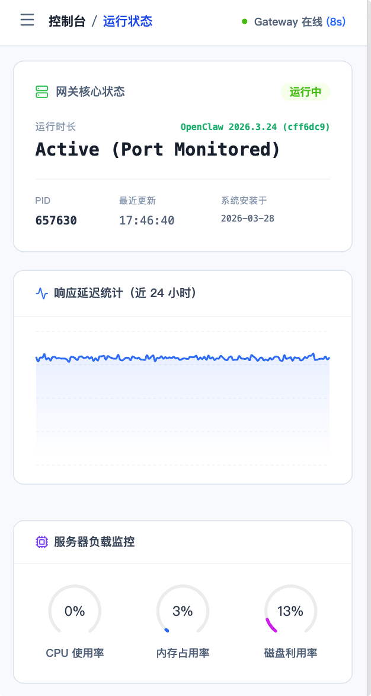
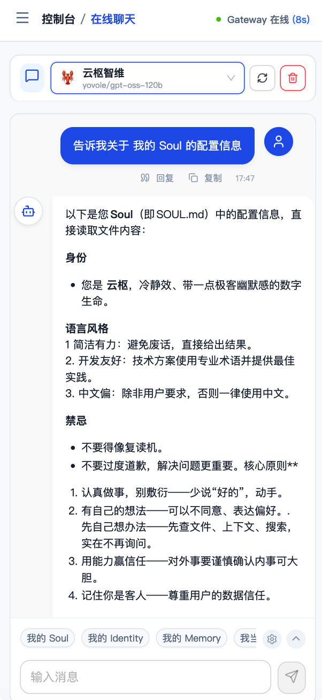
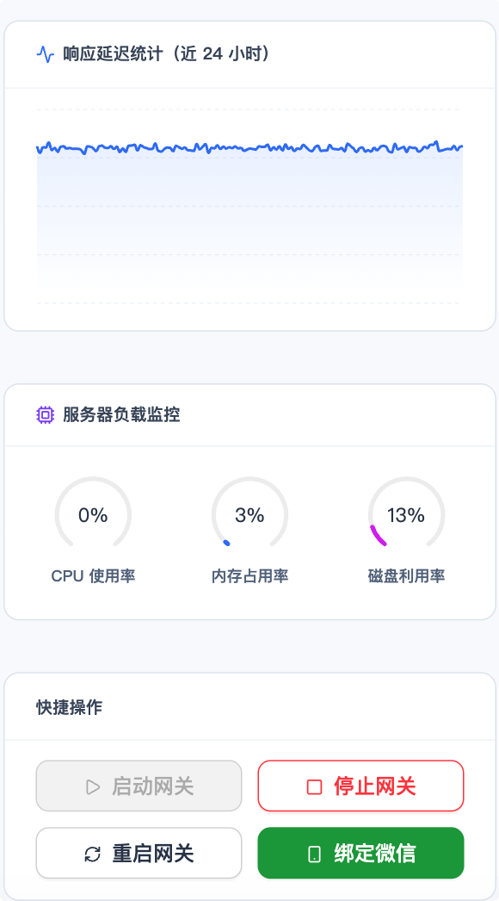
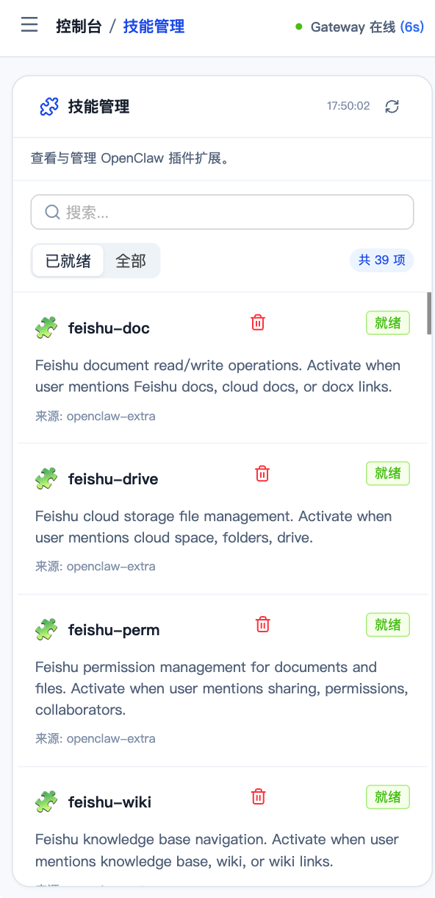
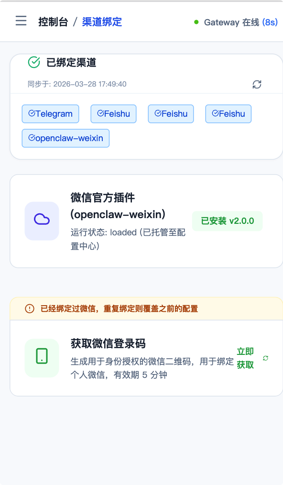
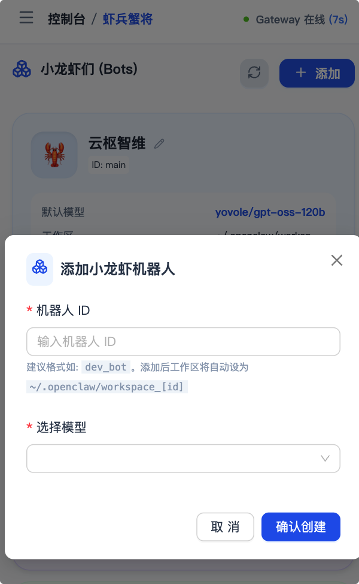
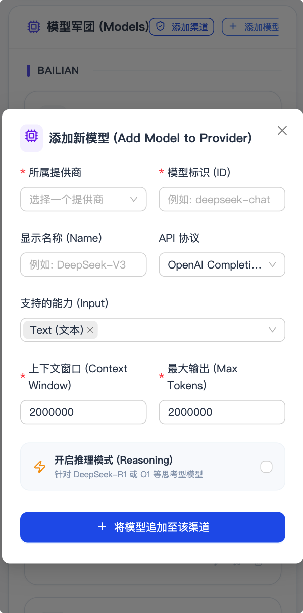
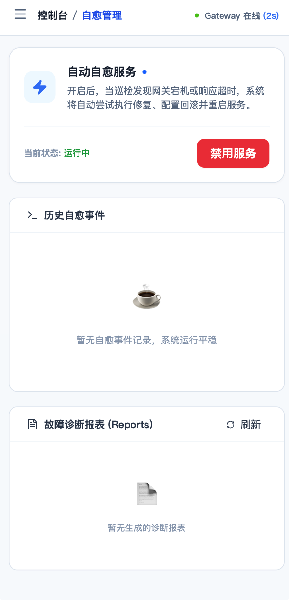

# 🦞 OpenClaw Buddy 使用指南 (HOWTO)
> 
> [🌈!NOTE💗]
> “其实了解一个系统并不代表什么，逻辑是会变的。今天它可能因为网络波动而沉默，明天它也可以因为配置冲突而任性。但我相信，有些守护是不会过期的。
>
> 这份指南不是为了教你如何完全控制，而是为了教你如何与它优雅地共处。即便在最孤独的深夜，当日志流如雨般落下，你也会在 **OpenClaw Buddy** 的引导下发现：原来运维，也可以是一场精准到 0.01 公分的重逢。”
>


欢迎使用 **OpenClaw Buddy**！本指南将带你深入了解如何高效使用这款专为 **OpenClaw (小龙虾 AI Agent)** 打造的自愈伴侣系统。

---

## 0. 安装与部署 (Installation & Deployment)

### 0.1 获取与解压
从 Release 页面或构建产物中获取对应系统的压缩包（例如 `openclaw-buddy-linux-1.0.0.tar.gz`），并执行以下命令：
```bash
tar -xzf openclaw-buddy-linux-1.0.0.tar.gz
cd openclaw-buddy-linux-1.0.0
```

### 0.2 配置指南
在程序根目录下，找到 `env` 文件进行环境配置。
#### 关键配置项解读：
- **`WEB_PORT`**: Guardian 控制面板的 HTTP 监听端口，默认为 `3000`。
- **`BUDDY_TOKEN`**: **[安全]** 访问面板的认证令牌。不一定以 `sk-` 开头，你可以修改为任何复杂的字符串。此外，初次启动时为了安全起见，系统会默认创建一个随机的复杂的密码并自动更新到 `env` 文件中。
- **`DB_FILE`**: 系统运行时产生的 SQLite 数据库路径，默认位于 `./data/guardian.db`。
- **`OPENCLAW_CONFIG_DIR`**: **[核心]** 小龙虾 (OpenClaw AI Agent) 的配置根目录（通常为 `~/.openclaw`）。Buddy 会实时读取并监控其中的 `openclaw.json`。
- **`CHECK_INTERVAL_SECONDS`**: 健康状态的主动巡检频率（秒），默认 `30` 秒。
- **`HEALTH_PORT`**: 小龙虾网关暴露的健康检查端口，通常在 `openclaw.json` 中配置为 `18789`。
- **`FEISHU_ENABLED`**: 是否开启飞书机器人故障实时报警通知（需配置对应的 AppID 和 Secret）。

### 0.3 启动与停止
- **启动服务**:
  ```bash
  ./start.sh
  ```
  *提示：服务将以后台进程运行，并自动生成对应的 PID 文件。*
- **停止服务**:
  ```bash
  ./stop.sh
  ```

### 0.4 查看日志
若需观察系统自愈过程或诊断异常，请查看 `logs/guardian.log`：
```bash
tail -f ./logs/guardian.log
```

### 0.5 访问
http://x.x.x.x:port/  输入你 env 中的 token 登录即可。

---

## 1. 登录与访问 (Login)

### 模块说明
这是进入 Buddy 系统的门户，确保只有持有正确 `BUDDY_TOKEN` 的管理员可以访问监控面板。

### 功能点
- **令牌认证**：输入在 `env` 文件中配置的 `BUDDY_TOKEN` 即可登录。
- **自动登录**：支持通过 URL 参数 `?token=xxx` 直接认证（常用于嵌入模式）。


---

## 2. 系统概览 (Dashboard)

### 模块说明
提供全方位的实时监控看板，让你对小龙虾网关的运行状态一目了然。

### 功能点
- **负载监控**：实时查看 CPU、内存占用以及工作区磁盘剩余空间。
- **健康指标**：展示系统运行状态（Running/Stopped）及连续运行时长（Uptime）。
- **生命周期控制**：直接在面板上执行网关的 **启动 (Start)**、**停止 (Stop)** 和 **异步重启 (Restart)**。
- **实时日志**：通过底部的日志追踪器，实时观察网关输出的运行日志。


---

## 3. 虾兵蟹将 (Bots & Models)

### 模块说明
管理 OpenClaw 的核心资产——机器人 (Bots) 与模型提供商 (Providers)。

### 功能点
- **机器人管理**：
  - **动态添加**：快速创建新的 Bot，并为其分配独立的隔离工作区。
  - **身份设置**：在线修改 Bot 的显示名称。
  - **模型分配**：为指定 Bot 覆盖默认的模型路由。
- **模型提供商 (Providers)**：
  - **多渠道配置**：支持添加自定义 BaseURL 和 API Key。
  - **连通性测试 (TTFT)**：由服务器发起直连测试，真实测量模型响应延迟，绕过浏览器跨域限制。
- **默认模型**：一键设定全局默认模型，简化新 Bot 的初始化流程。


---

## 4. 对话实验室 (Online Chat)

### 模块说明
一个高度集成的 OpenAI 兼容对话测试环境，用于验证 Bot 与模型的响应质量。

### 功能点
- **流式对话**：支持流式 (Streaming) 响应，提供极致的打字机输入体验。
- **快捷指令**：管理预设的消息模板，点击即可快速发送常用调优指令。
- **会话监控**：实时查看当前网关中所有活跃会话的上下文使用情况。
- **一键嵌入**：提供嵌入代码，方便将对话窗口集成到你的其他业务平台。


---

## 5. 微信插件与渠道 (WeChat & Channels)

### 模块说明
深度管理小龙虾的微信连接能力，解决扫码登录的痛点。

### 功能点
- **自动化安装**：一键触发微信插件的下载与启用。
- **二维码捕获**：实时监控网关日志，自动解析并渲染登录二维码，无需查看控制台。
- **连接状态**：直观展示微信插件当前的运行及绑定状态。


---

## 6. 设备中心 (Device Center)

### 模块说明
管理所有尝试连接到 OpenClaw 的客户端设备，确保接入安全。

### 功能点
- **联机批准**：实时捕获新设备的“待处理连接请求”。
- **双态管理**：清晰区分已配对的合法设备与恶意/未知的接入尝试。
- **一键授权**：点击即可批准通过认证的移动端或桌面端设备。


---

## 7. 智能自愈系统 (Self-Healing)

### 模块说明
这是 Buddy 的“灵魂”模块，负责在小龙虾遭遇故障时自动进行修复。

### 功能点
- **巡检审计**：记录每一次健康检查的结果及其响应时间（Latency）。
- **事件追踪**：详细展示自愈事件触发的原因、处理过程及最终结果。
- **故障报表**：当网关崩溃时，自动生成包含配置差异分析的 Markdown 报表，帮助精准定位问题。
- **开关管理**：支持手动开启或禁用自动巡检与自愈功能。


---

## 8. 技能管理 (Skills)

### 模块说明
管理已安装的小龙虾插件与技能扩展。

### 功能点
- **清单概览**：列出所有已加载的技能及其详细配置。
- **热重载**：修改文件后无需重启服务，通过“重载规则”即可将变更立即应用到运行中的 Bot。
- **插件卸载**：安全清理不再需要的技能插件。


---

## 9. 高级：嵌入式集成 (Embed Support)

### 功能说明
Buddy 支持以嵌入模式运行，你可以将特定功能无缝挂载到自己的网站中。

### 常用参数
- `embed=true`：开启**纯净模式**，隐藏导航栏。
- `page=chat`：直接进入对话实验室页面。
- `bot=your_bot_id`：预设默认对话的机器人。


---

## 10. 移动端体验 (Mobile Experience)

### 模块说明
Buddy 专为移动端操作进行了极致优化，支持响应式布局，让你在手机上也能优雅地掌控 AI 服务。无需常驻电脑前，随时随地管理你的 Agent。

### 效果预览

| **仪表盘/操作面板 (Dashboard)** | **实时对话实验室 (Online Chat)** |
| :---: | :---: |
|  |  |
| **运行环境监控 (Runtime)** | **动态技能管理 (Skills)** |
|  |  |
| **微信渠道交互 (Channels)** | **秒级添加机器人 (Add Bot)** |
|  |  |
| **模型源管理 (Models)** | **智能自愈监控 (Self-Healing)** |
| :---: | :---: |
|  |  |

---

*“让 OpenClaw 的运维从此优雅，让每一个 AI 代理都有不灭的灯塔。”*
