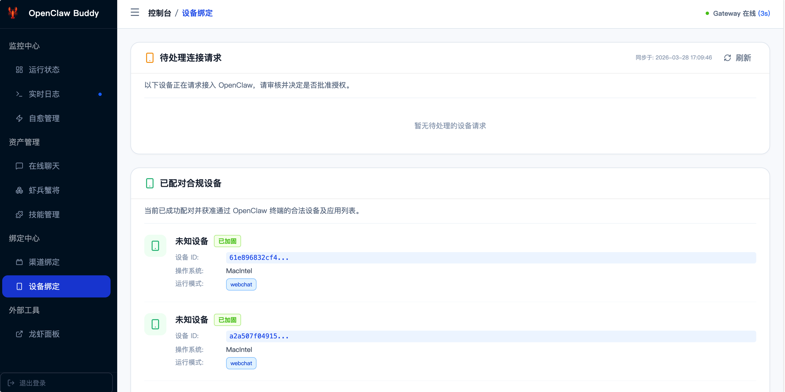
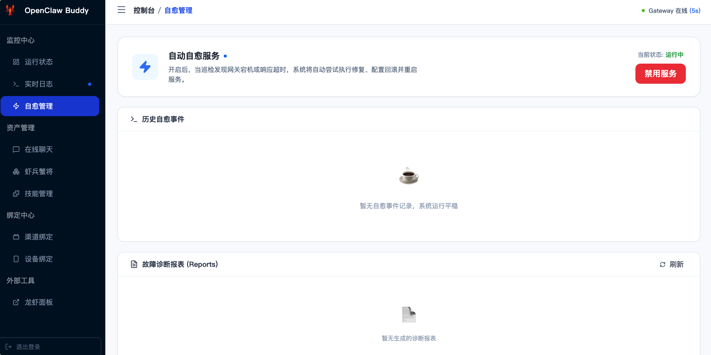
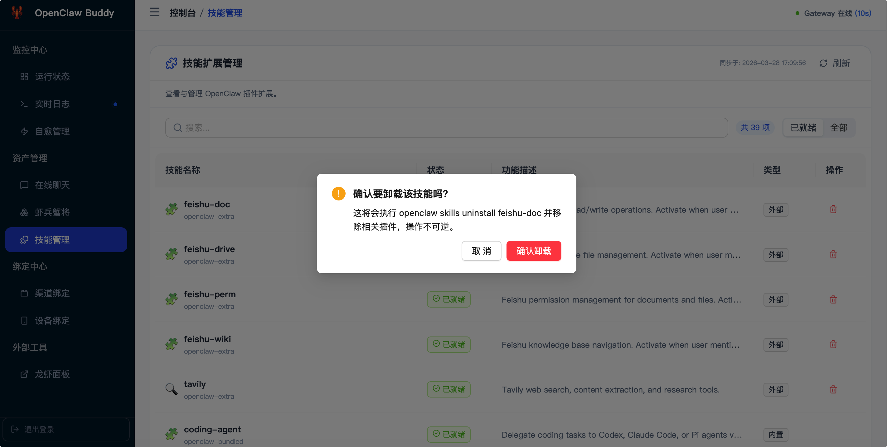
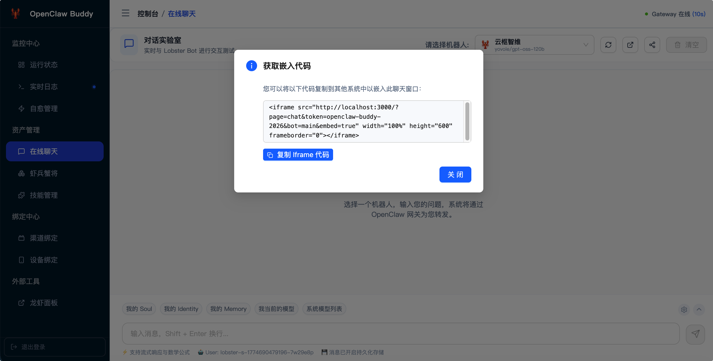

# 🦞 OpenClaw Buddy 使用指南 (HOWTO)

欢迎使用 **OpenClaw Buddy**！本指南将带你深入了解如何高效使用这款专为 **OpenClaw (小龙虾 AI Agent)** 打造的自愈伴侣系统。

---

## 1. 登录与访问 (Login)

### 模块说明
这是进入 Buddy 系统的门户，确保只有持有正确 `BUDDY_TOKEN` 的管理员可以访问监控面板。

### 功能点
- **令牌认证**：输入在 `env` 文件中配置的 `BUDDY_TOKEN` 即可登录。
- **自动登录**：支持通过 URL 参数 `?token=xxx` 直接认证（常用于嵌入模式）。

---

## 2. 系统概览 (Dashboard)

### 模块说明
提供全方位的实时监控看板，让你对小龙虾网关的运行状态一目了然。

### 功能点
- **负载监控**：实时查看 CPU、内存占用以及工作区磁盘剩余空间。
- **健康指标**：展示系统运行状态（Running/Stopped）及连续运行时长（Uptime）。
- **生命周期控制**：直接在面板上执行网关的 **启动 (Start)**、**停止 (Stop)** 和 **异步重启 (Restart)**。
- **实时日志**：通过底部的日志追踪器，实时观察网关输出的运行日志。

---

## 3. 虾兵蟹将 (Bots & Models)

### 模块说明
管理 OpenClaw 的核心资产——机器人 (Bots) 与模型提供商 (Providers)。

### 功能点
- **机器人管理**：
  - **动态添加**：快速创建新的 Bot，并为其分配独立的隔离工作区。
  - **身份设置**：在线修改 Bot 的显示名称。
  - **模型分配**：为指定 Bot 覆盖默认的模型路由。
- **模型提供商 (Providers)**：
  - **多渠道配置**：支持添加自定义 BaseURL 和 API Key。
  - **连通性测试 (TTFT)**：由服务器发起直连测试，真实测量模型响应延迟，绕过浏览器跨域限制。
- **默认模型**：一键设定全局默认模型，简化新 Bot 的初始化流程。

---

## 4. 对话实验室 (Online Chat)

### 模块说明
一个高度集成的 OpenAI 兼容对话测试环境，用于验证 Bot 与模型的响应质量。

### 功能点
- **流式对话**：支持流式 (Streaming) 响应，提供极致的打字机输入体验。
- **快捷指令**：管理预设的消息模板，点击即可快速发送常用调优指令。
- **会话监控**：实时查看当前网关中所有活跃会话的上下文使用情况。
- **一键嵌入**：提供嵌入代码，方便将对话窗口集成到你的其他业务平台。

---

## 5. 微信插件与渠道 (WeChat & Channels)

### 模块说明
深度管理小龙虾的微信连接能力，解决扫码登录的痛点。

### 功能点
- **自动化安装**：一键触发微信插件的下载与启用。
- **二维码捕获**：实时监控网关日志，自动解析并渲染登录二维码，无需查看控制台。
- **连接状态**：直观展示微信插件当前的运行及绑定状态。

---

## 6. 设备中心 (Device Center)

### 模块说明
管理所有尝试连接到 OpenClaw 的客户端设备，确保接入安全。

### 功能点
- **联机批准**：实时捕获新设备的“待处理连接请求”。
- **双态管理**：清晰区分已配对的合法设备与恶意/未知的接入尝试。
- **一键授权**：点击即可批准通过认证的移动端或桌面端设备。

---

## 7. 智能自愈系统 (Self-Healing)

### 模块说明
这是 Buddy 的“灵魂”模块，负责在小龙虾遭遇故障时自动进行修复。

### 功能点
- **巡检审计**：记录每一次健康检查的结果及其响应时间（Latency）。
- **事件追踪**：详细展示自愈事件触发的原因、处理过程及最终结果。
- **故障报表**：当网关崩溃时，自动生成包含配置差异分析的 Markdown 报表，帮助精准定位问题。
- **开关管理**：支持手动开启或禁用自动巡检与自愈功能。

---

## 8. 技能管理 (Skills)

### 模块说明
管理已安装的小龙虾插件与技能扩展。

### 功能点
- **清单概览**：列出所有已加载的技能及其详细配置。
- **热重载**：修改文件后无需重启服务，通过“重载规则”即可将变更立即应用到运行中的 Bot。
- **插件卸载**：安全清理不再需要的技能插件。

---

## 9. 高级：嵌入式集成 (Embed Support)

### 功能说明
Buddy 支持以嵌入模式运行，你可以将特定功能无缝挂载到自己的网站中。

### 常用参数
- `embed=true`：开启**纯净模式**，隐藏导航栏。
- `page=chat`：直接进入对话实验室页面。
- `bot=your_bot_id`：预设默认对话的机器人。

---

*“让 OpenClaw 的运维从此优雅，让每一个 AI 代理都有不灭的灯塔。”*
