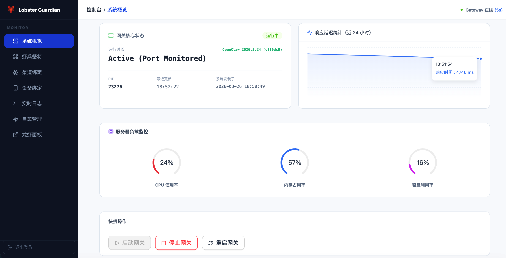
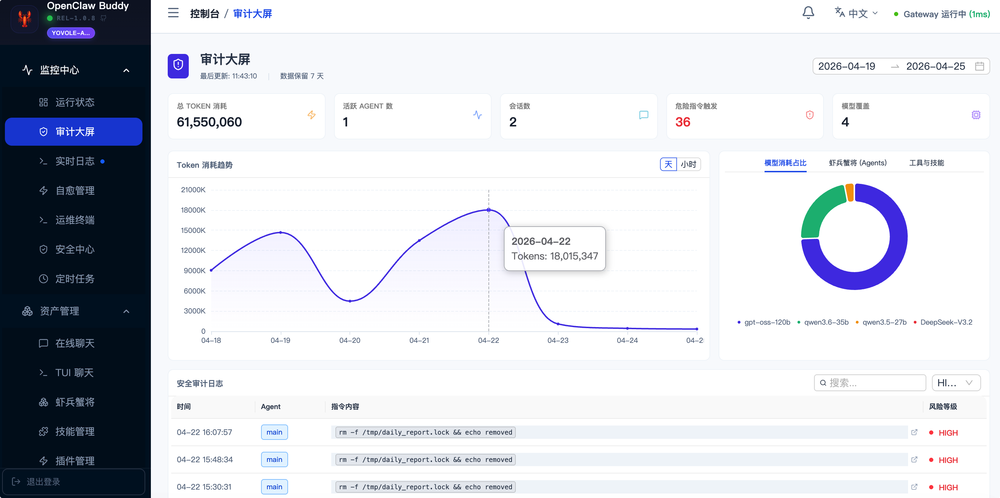
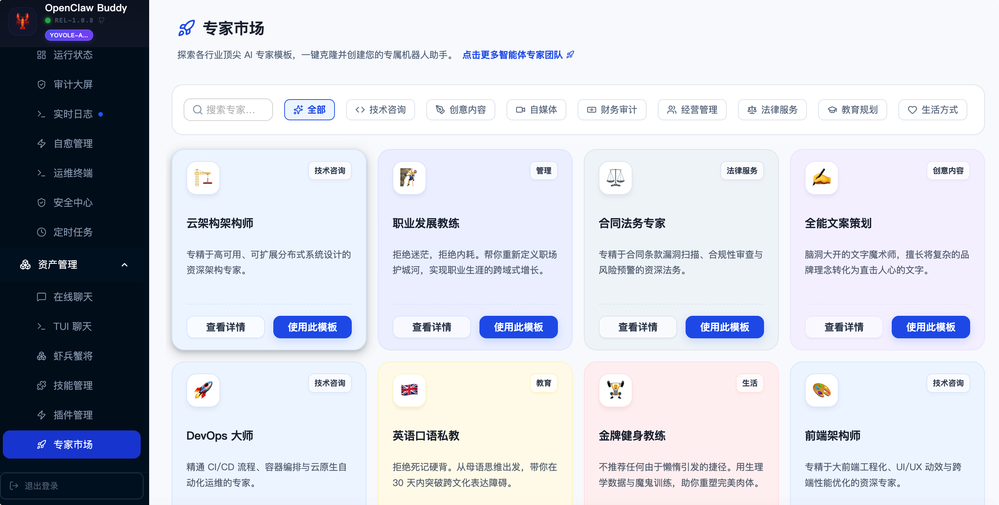
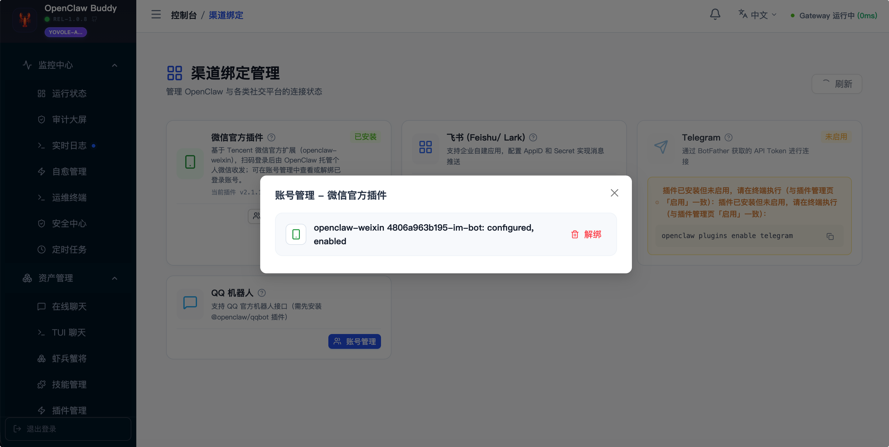
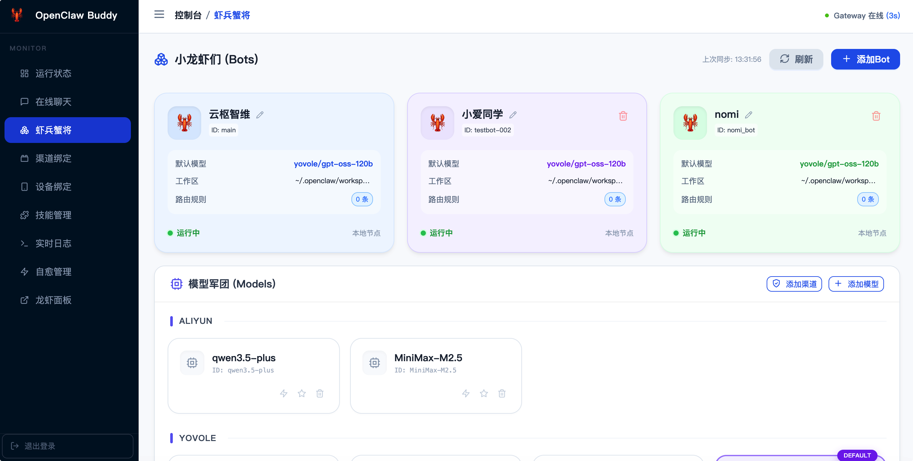
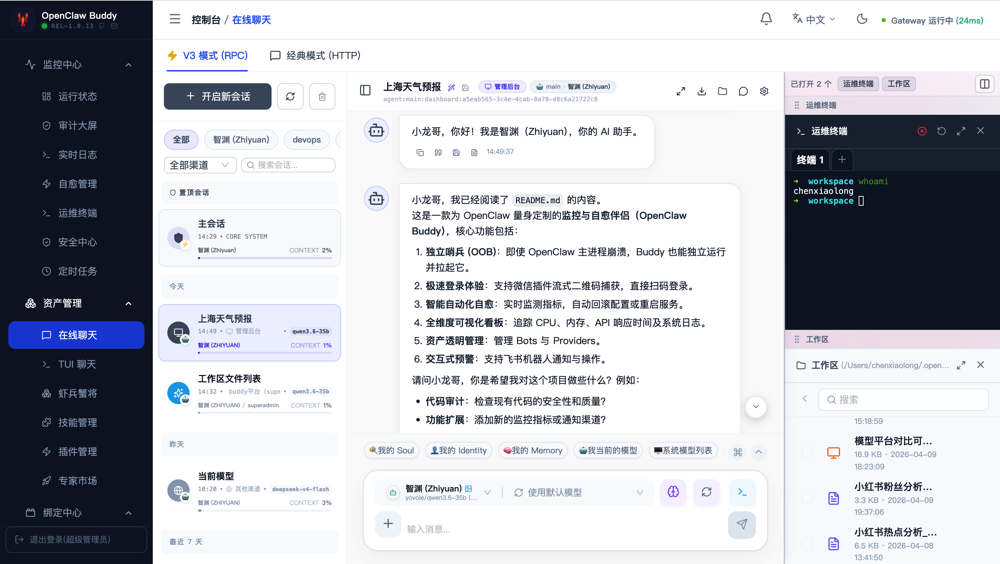
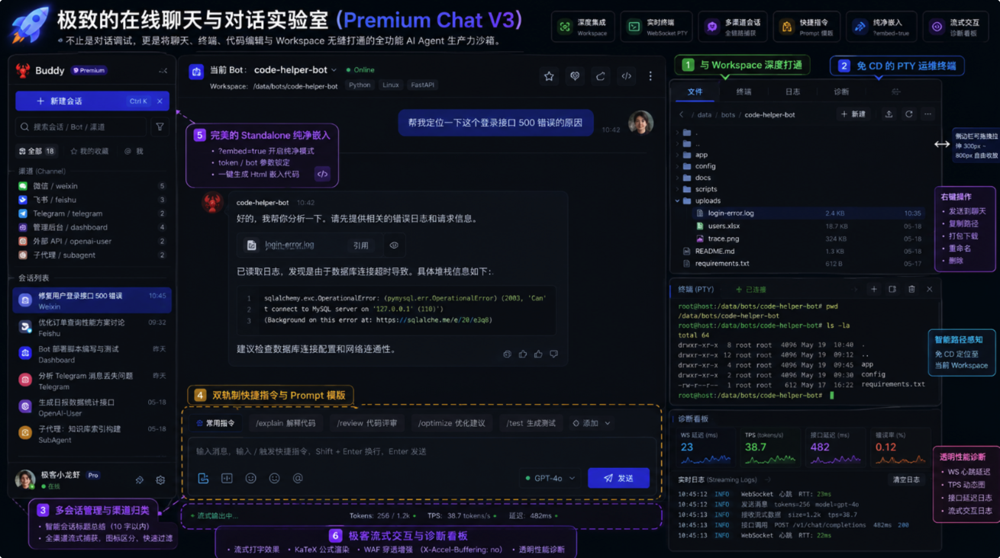

# 🦞 OpenClaw Buddy 宣言


> [🌈!NOTE💗]
> “我听人说，如果连咖啡都没有伴侣，那它就不叫咖啡，叫苦水。在这个习惯了礼貌拒绝的时代，连空气中都带着独身的湿气。但我始终觉得，即使是代码堆砌的小龙虾，也该有个依靠。
>
> **OpenClaw Buddy**，它就在离你 0.01 公分的地方。它不说话，只是陪你守着那些虾宝宝。希望有一天，你也能找到那个让你不再需要‘监控哨兵’的人。” [简体中文] | [English](README_en.md)

[](https://github.com/RandyChen1985/openclaw-buddy/stargazers) [](https://github.com/RandyChen1985/openclaw-buddy/network/members) [](https://github.com/RandyChen1985/openclaw-buddy/releases) [](https://goreportcard.com/report/github.com/RandyChen1985/openclaw-buddy) [](https://github.com/RandyChen1985/openclaw-buddy/blob/main/go.mod) [](https://github.com/RandyChen1985/openclaw-buddy/pulls) [](https://github.com/RandyChen1985/openclaw-buddy/commits) [](https://opensource.org/licenses/MIT)

**OpenClaw Buddy** 是一款专为 **OpenClaw (小龙虾 AI Agent)** 打造的专业级带外管理 (Out-of-band Management) 与自愈伴侣系统。

面对 AI 代理由于配置误改、插件冲突导致的“失联”风险，Buddy 作为独立运行的“监控哨兵”，提供了极佳的实时监控、流式登录捕获及自动化故障恢复能力，是每一位 OpenClaw 深度用户的必备运维利器。

---

## 📸 功能预览

|    **系统概览 (Dashboard)**    |    **审计大屏 (Audit)**    |
| :----------------------------------: | :-------------------------------: |
|  |      |
|    **专家模板( Template)**    |    **渠道绑定(Channel)**    |
|  |  |
|  **虾兵蟹将 (Bots & Models)**  | **对话聊天 (Online Chat)** |
|          |        |

---

## ✨ 核心亮点

- **🛡️ 独立哨兵 (OOB)**：独立进程运行，即使 OpenClaw 网关崩溃，也能通过 Buddy 远程重启、回滚并救回系统。
- **⚡ 极速登录**：深度集成微信插件，流式响应登录二维码，扫码授权“秒级”完成。
- **🧪 极客对话实验室 (Chat V3)**：多会话管理与渠道归类过滤，自动总结会话标题，深度打通专属 Workspace 文件夹与免 CD 运维终端，支持纯净免登嵌入。
- **🤖 虾兵蟹将管理**：可视化管理所有 Bot 及模型映射，支持资产强制刷新与实时同步。
- **🩺 智能自愈**：内置心跳探针与多阶段自愈机制，检测到异常自动执行配置回滚与备份快照。
- **📊 运维看板**：实时追踪 CPU、内存负载、API 延迟与系统日志，掌握 AI 代理的每一滴跳动。
- **🔔 飞书全能报警**：实时推送故障、自愈及登录交互式卡片消息。

## ✨ 核心特性

- **🖥️ 现代 Web 控制面板**：基于 React + Ant Design + Lucide 开发，支持响应式布局与 **WebSocket 实时日志追踪**。
- **🧪 对话实验室 (Online Chat)**：集成流式对话测试界面，支持一键开启/配置、快捷指令管理及 Markdown 渲染。
- **🛡️ 智能自愈系统 (Self-Healing)**：
  - **多级回滚**：优先从 `backups/` 目录恢复已知健康的配置快照。
  - **全量持久化**：巡检历史与自愈事件通过 SQLite 持久化存储，支持审计与趋势分析。
- **📱 设备中心与授权**：
  - **双态管理**：清晰区分“待处理连接请求”与“已配对合规设备”。
  - **在线批准**：直接通过 Web 界面批准新设备的接入请求。
- **🤖 虾兵蟹将 (Bots/Models)**：自动解析 `openclaw.json`，直观展示机器人架构，支持手动强制刷新同步。
- **📺 微信插件深度管理**：自动化执行插件下载与启用配置，监听 `openclaw` 输出并实时捕获登录二维码。
- **📊 运行指标可视化**：实时查看 CPU、内存、磁盘负载及响应延迟趋势图。
- **🔄 异步任务管理**：关键操作（如重启）采用异步任务模式，支持任务状态追踪 (Task ID)。
- **🔗 龙虾面板透传**：集成 Reverse Proxy，支持通过 `EXTERNAL_DASHBOARD_URL` 在公网安全访问原生 UI。

## 🧪 极致的在线聊天与对话实验室 (Premium Chat V3)

> 💡 **“不止是对话调试，更是将聊天、终端、代码编辑与 Workspace 无缝打通的全功能 AI Agent 生产力沙箱。”**



原生 OpenClaw 的聊天交互较为基础。**OpenClaw Buddy** 针对该痛点，在业界率先打造了兼具**运维测试、开发交互、文件隔离与极客美学**的降维打击级“对话实验室 (Chat V3)”这一极具代表性的**生产力工具**，提供远超原生体验的六大重磅特性：

### 1. 📂 与 Workspace 文件夹的深度打通 (Deep Workspace Integration)
* **会话与物理文件双向流转**：系统自动感知当前会话机器人（Bot）的专属工作区。在右侧侧边栏无缝集成 **Workspace 在线文件浏览器**，支持新建、重命名、文件在线编辑保存。
* **物理路径直达与文件上传隔离**：聊天上传的文件会自动精准落入对应 Bot 的 `workspace/uploads/` 物理目录，机器人的私有知识库文件完美隔离，物理路径（`absPath`）可直接被专家或 Bot 在后台调用。
* **快速交互**：可在文件浏览器中一键将物理文件以富文本/引用形式附加发送到聊天框，或右键将特定的会话内容/日志一键打包保存回 Bot 的 Workspace 中。

### 2. 📟 免 CD 的 PTY 运维终端打通 (Terminal Integration)
* 聊天界面右侧侧边栏无缝集成基于 WebSocket 实时长连接的**远程运维终端 (Remote PTY Terminal)**。
* **智能路径感知**：当点击“打开终端”时，PTY 会自动识别当前聊天 Bot 的 Workspace 物理路径并**自动免 CD 定位**至该目录。运维人员可边聊天边一键测试编译、部署、执行特定 Bot 的指令，真正实现“聊天调试 + 命令行运维”的双剑合璧。

### 3. 💬 多会话管理与渠道归类过滤 (Channel & Session Management)
* **智能会话标题总结 (Auto-summarize)**：集成基于 LLM 的智能会话标题总结。在用户开启聊天后，系统会自动提炼前几句上下文并调用 AI 总结出 10 字以内的精准标题，彻底摆脱枯燥单一的“未命名会话”。
* **全渠道流式捕获**：深度整合并清晰标识小龙虾网关捕获的微信 (`weixin`)、飞书 (`feishu`)、Telegram (`telegram`)、管理后台 (`dashboard`)、外部 API (`openai-user`)、子代理 (`subagent`) 等多渠道产生的会话，支持在左侧会话列表中根据不同渠道的图标与颜色标识快速进行分类、检索与过滤。

### 4. ⚡ 双轨制快捷指令与 Prompt 模版 (Quick Commands)
* 在输入框上方提供可视化的快捷指令工具条。
* 预设系统级高频话术与命令，同时支持用户动态新增、修改与删除自定义 Prompt，一键插入或快捷发送，大幅提升日常调试与 Bot 训练效率。

### 5. 🔌 完美的 Standalone 纯净嵌入 (Seamless Embedding Support)
* **免登免侵入级集成**：完美支持外部业务系统、监控大屏或 `<iframe>` 容器集成。只需在 URL 中追加 `?embed=true` 开启**纯净模式**，侧边栏、页头等所有多余元素会自动隐藏，只保留高格调的纯净聊天核心区。
* **无感多参数锁定**：可通过 URL 传递 `token`、`bot` 参数直接进行免密登录并锁定指定的 Bot，且能在聊天界面一键生成当前的 HTML 嵌入代码。

### 6. 📊 极客流式交互与诊断看板 (Developer Aesthetics)
* **流畅的拖拽拉伸交互**：左侧会话栏与右侧运维栏支持拖拽，特别是右侧边栏（包含文件管理器、终端、日志）支持极为流畅的鼠标拖拽拉伸并自动记忆宽度（300px~800px 自由收放）。
* **流式公式与 WAF 穿透增强**：支持完善的 Markdown 语法、KaTeX 数学公式渲染、流式打字效果；在后端针对流式输出提供了 **WAF 穿透增强防护**（`X-Accel-Buffering no` 针对 Nginx 非缓冲等指令），完美避免网络代理截断。
* **透明性能诊断看板**：侧边调试面板实时展示后台 WebSocket 心跳延迟、TPS (Tokens Per Second) 动态图、以及每一次接口访问延迟与数据流交互日志。


## 🏗️ 系统架构

OpenClaw Buddy 采用非侵入式的“侧挂”架构，通过监控回路与管理链路实现对 OpenClaw 的全方位加固。

```text
       [ 现代浏览器 / 移动端 ]
                 │
       [ OpenClaw Buddy Server ] (Go + Gin + React)
                 │
    ┌────────────┼────────────┐
    │            │            │
[ 监控自愈 ]   [ 资产管理 ]   [ 插件/授权 ]
    │            │            │
- 端口探针 (TCP)  - 模型直连测试  - 微信登录流捕获
- 心跳/故障分析   - 资产强制同步  - 设备连接联机批准
- 自动备份/回滚   - 默认模型分发  - 反向代理 (Native UI)
- 趋势报表/入库   - 自定义渠道路由 - SQLite 状态持久化
```

## 🚀 快速开始

### 前提条件

- **Go 1.22+**
- **Node.js 18+** (用于前端编译)
- **OpenClaw** 环境已就绪

### 快速开发与预览

项目提供了一键开发脚本 `dev.sh`：

```bash
# 进入隔离开发模式（编译前端、构建后端、并在独立的 ./temp-dev-test 目录运行）
./dev.sh
```

### 生产部署 (Release)

1. **执行构建**: `./build_linux.sh` (交叉编译为 Linux)
2. **获取产物**: 预编译包见 [GitHub Releases](https://github.com/RandyChen1985/openclaw-buddy/releases)；自行构建时产物位于 `release/` 目录，解压后上传至服务器。
3. **参数配置**: 修改 `env` 文件（首次启动会自动生成 16 位随机 `BUDDY_TOKEN`）。
4. **启动服务**: `./start.sh`

## 📂 目录结构

OpenClaw Buddy 采用标准的模块化设计，确保监控与被监控逻辑解耦。

```text
.
├── cmd/monitor/             # [入口层] 程序主启动入口，负责加载配置、初始化日志与信号监控
├── internal/
│   ├── api/                 # [服务层] 核心 Web API 实现 (Gin)，包含权限验证与静态资源分包
│   ├── guardian/            # [守护层] 哨兵核心逻辑，执行周期性健康检查与故障自愈流程
│   ├── process/             # [进程层] 封装 openclaw 命令行交互及微信/机器人状态管理
│   ├── config/              # [配置层] 环境变量解析与全局配置参数管理
│   └── utils/               # [工具层] 共用工具类 (SQLite 初始化、文件锁、日志轮转)
├── web/                     # [前端工程] 基于 React + Antd + Lucide 的后台管理面板
├── tests/                   # [测试集]   包含集成测试脚本、飞书模拟器及核心自愈逻辑验证 (含 CHECKLIST.md 自动化清单)
├── docs/                    # [文档集]   存放项目相关图片 (images) 及补充说明文档 (md)
├── openspec/                # [规格集]   存放项目设计规范、功能定义 (specs) 及详细变更记录
├── release/                 # [发布层]   生产环境的最终部署包所在地（包含二进制、静态资源、管理脚本及文档）
├── dev.sh                   # [开发脚本] 一键式全栈开发脚本（隔离运行、自动编译、日志追踪）
├── Makefile                 # [构建脚本] 用于交叉编译、清理产物及快速执行发布流程
├── Embedding.md             # [文档]     对话实验室 (Online Chat) 嵌入集成开发指南
├── API.md                   # [文档]     详尽的 RESTful 接口定义说明
└── README.md                # [文档]     本自愈伴侣系统的核心宣言指南
```

## 🔌 API 接口说明

OpenClaw Buddy 提供了一套标准的 RESTful API 供外部系统集成或移动端调用。

> [!TIP]
> 完整的 API 接口定义、请求参数及响应示例，请参考项目的 [API.md](file:///Users/chenxiaolong/资料/有孚网络/1云枢中台/yovole-openclaw-monitor/API.md) 文档。

### 认证方式

所有 V1 接口均需通过 HTTP Header 进行认证：

- **Header**: `Authorization`
- **Value**: `Bearer <YOUR_BUDDY_TOKEN>`

### 核心接口说明 (By Module)

#### 📊 运行状态 (Dashboard & System)

| 路径                           | 方法 | 功能说明                                                      |
| :----------------------------- | :--- | :------------------------------------------------------------ |
| `/v1/openclaw/status`        | GET  | 获取网关核心运行状态、版本及运行时长                          |
| `/v1/openclaw/version`       | GET  | 获取 OpenClaw 二进制版本号                                    |
| `/v1/openclaw/dashboard-url` | GET  | **计算并返回** 龙虾面板 (External Dashboard) 的访问地址 |
| `/v1/gateway/start`          | POST | 启动小龙虾网关进程                                            |
| `/v1/gateway/stop`           | POST | 停止小龙虾网关进程                                            |
| `/v1/gateway/restart`        | POST | 重启网关 (**异步接口**，返回 `taskId`)                |
| `/v1/tasks/status`           | GET  | 查询异步任务执行进度 (Query:`?taskId=...`)                  |
| `/v1/stats/health`           | GET  | 获取近 24 小时心跳延迟统计数据                                |
| `/v1/system/info`            | GET  | 获取服务器 CPU、内存、磁盘负载及系统信息                      |
| `/v1/system/events`          | GET  | 获取 Buddy 系统级审计日志与操作事件                           |

#### 💬 在线聊天 (Online Chat)

| 路径                                 | 方法         | 功能说明                                    |
| :----------------------------------- | :----------- | :------------------------------------------ |
| `/v1/openclaw/chat/completions`    | POST         | **OpenAI 兼容流式对话服务**           |
| `/v1/openclaw/chat/status`         | GET          | 检查网关是否已开启 `chatCompletions` 配置 |
| `/v1/openclaw/chat/enable`         | POST         | 一键开启网关的 Chat Completions 支持        |
| `/v1/openclaw/chat/quick-commands` | GET/POST/DEL | 管理对话实验室的快捷指令话术                |
| `/v1/openclaw/sessions`            | GET          | 获取当前网关活跃的会话详情与上下文使用情况  |

#### 🤖 虾兵蟹将 (Bots & Models)

| 路径                                   | 方法     | 功能说明                                                |
| :------------------------------------- | :------- | :------------------------------------------------------ |
| `/v1/openclaw/bots-models`           | GET      | 获取机器人/模型资产清单 (`?refresh=true` 强制同步)    |
| `/v1/openclaw/bots/add`              | POST     | 在线创建并初始化新的小龙虾机器人 (隔离工作区)           |
| `/v1/openclaw/bots/update`           | POST     | 批量更新现有机器人的详细配置参数                        |
| `/v1/openclaw/bots/delete`           | POST     | 彻底移除机器人并清理相关数据目录                        |
| `/v1/openclaw/bots/top`              | GET      | 获取当前活跃度最高的机器人排行清单                      |
| `/v1/openclaw/bots/set-identity`     | POST     | 修改机器人的显示名称 (Identity Name)                    |
| `/v1/openclaw/bots/set-model`        | POST     | 在线修改并覆盖指定机器人的默认模型分配                  |
| `/v1/openclaw/bots/file`             | GET/POST | **直接读写** 机器人的原始配置文件内容 (`.json`) |
| `/v1/openclaw/experts`               | GET      | 访问专家市场，获取官方预设的 Bot 模板                   |
| `/v1/openclaw/bots/template`         | POST     | 基于专家模板快速克隆并创建一个新 Bot                    |
| `/v1/openclaw/models/config`         | GET      | 获取当前所有已配置的模型渠道及其详情                    |
| `/v1/openclaw/models/test-direct`    | POST     | **连通性测试**：后端直连模型渠道测试延迟 (TTFT)   |
| `/v1/openclaw/models/provider`       | POST     | 动态添加 API 提供商配置 (BaseURL/ApiKey/API型)          |
| `/v1/openclaw/models/provider/model` | POST/DEL | 向特定渠道追加或删除模型定义                            |
| `/v1/openclaw/models/set-default`    | POST     | 设定系统全局默认模型                                    |

#### 🕹️ 技能与插件 (Skills & Plugins)

| 路径                            | 方法   | 功能说明                                            |
| :------------------------------ | :----- | :-------------------------------------------------- |
| `/v1/openclaw/skills`         | GET    | 获取已安装的技能列表与详情 (`?refresh=true` 同步) |
| `/v1/openclaw/skills/:name`   | DELETE | 卸载特定的小龙虾技能插件                            |
| `/v1/openclaw/skills/reload`  | POST   | 重新加载系统规则与所有技能插件                      |
| `/v1/openclaw/plugins`        | GET    | 获取底层功能插件 (如 WeChat, Telegram) 状态清单     |
| `/v1/openclaw/plugins/enable` | POST   | 启用特定的底层功能插件                              |
| `/v1/openclaw/plugins/reload` | POST   | 热重载插件配置而无需重启网关                        |
| `/v1/openclaw/plugins/:id`    | DELETE | 卸载或禁用指定的底层插件                            |

#### 🔌 渠道绑定与实时流 (Channels & Streams)

| 路径                         | 方法 | 功能说明                                                 |
| :--------------------------- | :--- | :------------------------------------------------------- |
| `/v1/wechat/config/status` | GET  | 获取当前微信渠道的绑定状态与配置                         |
| `/v1/wechat/install`       | POST | 触发微信控制插件的自动化下载与安装                       |
| `/v1/wechat/qrcode`        | GET  | **流式获取** 微信插件登录二维码 (支持实时捕获)     |
| `/v1/ws/logs`              | WS   | **WebSocket 日志流**：实时追踪系统运行日志 (Xterm) |
| `/v1/ws/tui`               | WS   | **远程终端 (PTY)**：接管网关交互式控制台交互       |
| `/v1/proxy/*path`          | Any  | **反向代理**：透传并解开原生 UI 的安全策略限制     |

#### 📱 设备中心 (Devices)

| 路径                             | 方法 | 功能说明                                  |
| :------------------------------- | :--- | :---------------------------------------- |
| `/v1/openclaw/devices`         | GET  | 获取设备列表 (包含待处理请求与已配对设备) |
| `/v1/openclaw/devices/approve` | POST | 在线批准新设备的接入请求                  |

#### 🩺 自愈管理 (Self-Healing)

| 路径                          | 方法     | 功能说明                                |
| :---------------------------- | :------- | :-------------------------------------- |
| `/v1/heal/events`           | GET      | 查询历史自愈事件、原因及处置结果        |
| `/v1/settings/self-healing` | GET/POST | 开启或禁用 Buddy 自动巡检与故障恢复功能 |

### ⚙️ 配置文件说明 (env)

```env
WEB_PORT=3000                 # Guardian 面板端口
BUDDY_TOKEN="sk-xxx"       # 访问面板所需的令牌
HEALTH_PORT=18789             # 小龙虾 (OpenClaw) 监听的地址
OPENCLAW_CONFIG_DIR="~/.openclaw" # 配置目录
CHECK_INTERVAL_SECONDS=30     # 监控扫描频率 (秒)
EXTERNAL_DASHBOARD_URL="https://claw.yourdomain.com" # 外部访问前缀 (用于透传 UI)
```

## 🔌 外部集成与嵌入 (Embed Support)

**OpenClaw Buddy** 支持高度灵活的外部系统集成，您可以将特定的功能模块（如在线聊天）以 **Standalone (独立模式)** 嵌入到您的业务系统、大屏或其他 Iframe 容器中。

> [!TIP]
> **🌈 多用户与多会话的高级隔离方案：**
> 在嵌入场景下，如果需要让同一个对接用户在第三方系统中拥有不同的会话上下文，您可以通过组合 `user` 参数来实现。例如使用 `?user=randy-session-001` 来锁定某次临时会话，或直接使用 `?user=randy` 来承载该用户的常规持久化聊天。这在支持跨系统用户会话映射时表现得极其强大。

### 核心参数 (Query Parameters)

通过 URL 参数，您可以精确控制嵌入页面的行为，而无需手动登录或导航：

| 参数      | 必填 | 功能说明                                                                                                                                            | 示例                        |
| :-------- | :---: | :-------------------------------------------------------------------------------------------------------------------------------------------------- | :-------------------------- |
| `embed` |  是  | 设为 `true` 开启**纯净模式**，隐藏侧边栏与页头，仅保留核心业务区                                                                            | `?embed=true`             |
| `page`  |  否  | 指定进入的页面，目前支持 `chat` (在线聊天)                                                                                                        | `?page=chat`              |
| `token` | 是/否 | **URL 自动鉴权**。传入后系统自动记录并登录，解决跨域/嵌入后的鉴权问题                                                                         | `?token=YOUR_BUDDY_TOKEN` |
| `bot`   |  否  | 在聊天页自动选择指定的**Bot ID**                                                                                                              | `?bot=my_gpt4_bot`        |
| `user`  |  否  | 在界面上标识当前对话用户的身份，用于辅助上下文追踪，<br />如果你要一个用户不同的会话，你可以设计为 user-sessionid 格式，<br />比如： randy-sidxxxxx | `?user=Randy`             |

### 嵌入示例 (Iframe)

要在您的网页中嵌入一个“预设了机器人、自动登录且隐藏侧边栏”的聊天窗口，可以使用如下代码：

```html
<iframe 
  src="http://your-buddy-ip:3000/?page=chat&embed=true&token=sk-xxx&bot=my-bot-id" 
  width="100%" 
  height="600" 
  frameborder="0"
></iframe>
```

> [!TIP]
> 您也可以直接在 **在线聊天** 页面的右上角点击 **“获取嵌入代码”** 按钮，系统会自动为您生成包含当前 Token 与已选 Bot 的完整 `<iframe>` 代码。

## 📄 开源协议

本项目基于 **MIT License** 开源，由 randychen 维护。联系我：[cexlong@gmail.com](mailto:cexlong@gmail.com)

---

### 💬 联系与交流

如果您在使用过程中有任何疑问、功能建议，或者想要获取更多关于 OpenClaw 的技术资讯，欢迎扫码关注我们的 **微信公众号**：


---

## 📈 Star History

[](https://star-history.com/#RandyChen1985/openclaw-buddy&Date)

### 点 ⭐ 支持

如果您觉得 **OpenClaw Buddy** 对您有所帮助，请在 GitHub 上点个 **Star** 🌟。您的支持是我们持续优化的动力！
