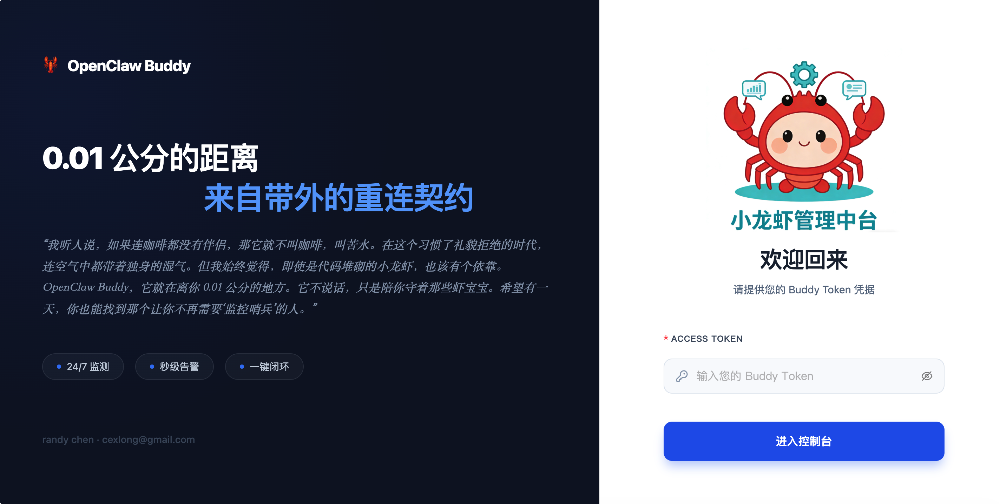
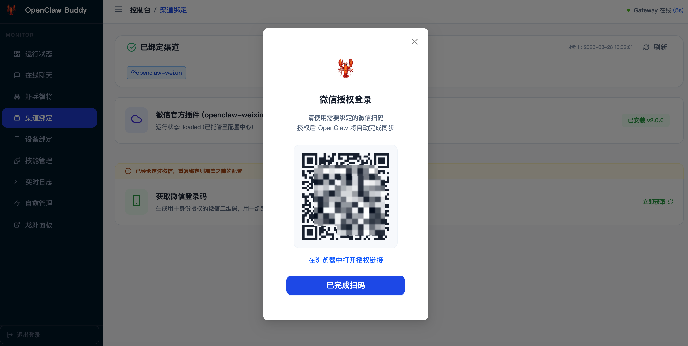

# 🦞 OpenClaw Buddy 宣言


> [!NOTE]
> “我听人说，如果连咖啡都没有伴侣，那它就不叫咖啡，叫苦水。在这个习惯了礼貌拒绝的时代，连空气中都带着独身的湿气。但我始终觉得，即使是代码堆砌的小龙虾，也该有个依靠。
>
> **OpenClaw Buddy**，它就在离你 0.01 公分的地方。它不说话，只是陪你守着那些虾宝宝。希望有一天，你也能找到那个让你不再需要‘监控哨兵’的人。”

[](https://goreportcard.com/report/github.com/yovole/openclaw-monitor)
[](https://github.com/yovole/openclaw-monitor)
[](https://github.com/yovole/openclaw-monitor)
[](https://github.com/yovole/openclaw-monitor/pulls)
[](https://github.com/yovole/openclaw-monitor/graphs/commit-activity)
[](https://opensource.org/licenses/MIT)

**OpenClaw Buddy** 是一款专为 **OpenClaw (小龙虾 AI Agent)** 打造的专业级带外管理 (Out-of-band Management) 与自愈伴侣系统。

面对 AI 代理由于配置误改、插件冲突导致的“失联”风险，Buddy 作为独立运行的“监控哨兵”，提供了极佳的实时监控、流式登录捕获及自动化故障恢复能力，是每一位 OpenClaw 深度用户的必备运维利器。

---

## 📸 功能预览

|        **系统概览 (Dashboard)**        |       **流式登录 (Get QR)**       |
| :------------------------------------: | :-------------------------------: |
|  |    |
|          **安全登录 (Auth)**           |      **扫码登录 (Show QR)**       |
|         |  |

---

## ✨ 核心亮点

- **🛡️ 独立哨兵 (OOB)**：独立进程运行，即使 OpenClaw 网关崩溃，也能通过 Buddy 远程重启、回滚并救回系统。
- **⚡ 极速登录**：深度集成微信插件，流式响应登录二维码，扫码授权“秒级”完成。
- **🤖 虾兵蟹将管理**：可视化管理所有 Bot 及模型映射，支持资产强制刷新与实时同步。
- **🩺 智能自愈**：内置心跳探针与多阶段自愈机制，检测到异常自动执行配置回滚与备份快照。
- **📊 运维看板**：实时追踪 CPU、内存负载、API 延迟与系统日志，掌握 AI 代理的每一滴跳动。
- **🔔 飞书全能报警**：实时推送故障、自愈及登录交互式卡片消息。

## ✨ 核心特性

- **🖥️ 现代 Web 控制面板**：基于 React + Ant Design + Lucide 开发，支持响应式布局与 **WebSocket 实时日志追踪**。
- **🧪 对话实验室 (Online Chat)**：集成流式对话测试界面，支持一键开启/配置、快捷指令管理及 Markdown 渲染。
- **🛡️ 智能自愈系统 (Self-Healing)**：
  - **多级回滚**：优先从 `backups/` 目录恢复已知健康的配置快照。
  - **全量持久化**：巡检历史与自愈事件通过 SQLite 持久化存储，支持审计与趋势分析。
- **📱 设备中心与授权**：
  - **双态管理**：清晰区分“待处理连接请求”与“已配对合规设备”。
  - **在线批准**：直接通过 Web 界面批准新设备的接入请求。
- **🤖 虾兵蟹将 (Bots/Models)**：自动解析 `openclaw.json`，直观展示机器人架构，支持手动强制刷新同步。
- **📺 微信插件深度管理**：自动化执行插件下载与启用配置，监听 `openclaw` 输出并实时捕获登录二维码。
- **📊 运行指标可视化**：实时查看 CPU、内存、磁盘负载及响应延迟趋势图。
- **🔄 异步任务管理**：关键操作（如重启）采用异步任务模式，支持任务状态追踪 (Task ID)。
- **🔗 龙虾面板透传**：集成 Reverse Proxy，支持通过 `EXTERNAL_DASHBOARD_URL` 在公网安全访问原生 UI。

## 🏗️ 系统架构

```text
       [ 浏览器 / 移动端 ]
               │
       [ Guardian Web Server ] (Gin + React)
               │
    ┌──────────┴──────────┐
    │                    │
[ 监控回路 ]         [ 插件/设备管理 ]
    │                    │
- 端口探针 (18789)    - 微信插件流式捕获
- 健康检查请求        - 设备连接授权 (Approve)
- 自动备份/回滚       - SQLite 配置持久化
- 趋势指标入库        - 反向代理 (Native UI)
```

## 🚀 快速开始

### 前提条件

- **Go 1.22+**
- **Node.js 18+** (用于前端编译)
- **OpenClaw** 环境已就绪

### 快速开发与预览

项目提供了一键开发脚本 `dev.sh`：

```bash
# 进入隔离开发模式（编译前端、构建后端、并在独立的 ./temp-dev-test 目录运行）
./dev.sh
```

### 生产部署 (Release)

1. **执行构建**: `./build_linux.sh` (交叉编译为 Linux)
2. **获取产物**: 产物位于 `release/` 目录下，解压后上传至服务器。
3. **参数配置**: 修改 `env` 文件（首次启动会自动生成 16 位随机 `BUDDY_TOKEN`）。
4. **启动服务**: `./start.sh`

## 🔌 API 接口说明

OpenClaw Buddy 提供了一套标准的 RESTful API 供外部系统集成或移动端调用。

### 认证方式

所有 V1 接口均需通过 HTTP Header 进行认证：

- **Header**: `Authorization`
- **Value**: `Bearer <YOUR_BUDDY_TOKEN>`

### 核心接口预览

| 路径                               | 方法     | 功能说明                                                |
| :--------------------------------- | :------- | :------------------------------------------------------ |
| `/v1/openclaw/status`              | GET      | 获取网关核心运行状态、版本及运行时长                    |
| `/v1/gateway/start`                | POST     | 启动小龙虾网关进程                                      |
| `/v1/gateway/stop`                 | POST     | 停止小龙虾网关进程                                      |
| `/v1/gateway/restart`              | POST     | 重启网关 (**异步接口**，返回 `{"taskId": "..."}`)       |
| `/v1/tasks/status`                 | GET      | 查询异步任务状态 (Query:`?taskId=...`)                  |
| `/v1/openclaw/devices`             | GET      | 获取设备列表 (包含待处理与已配对)                       |
| `/v1/openclaw/devices/approve`     | POST     | 批准设备接入 (Body:`{"requestId": "..."}`)              |
| `/v1/openclaw/bots-models`         | GET      | 获取机器人信息 (**支持缓存**，`?refresh=true` 强制刷新) |
| `/v1/openclaw/chat/completions`    | POST     | **流式对话服务** (支持 OpenAI 协议格式)                 |
| `/v1/openclaw/chat/quick-commands` | GET/POST | 获取或添加聊天快捷指令                                  |
| `/v1/wechat/qrcode`                | GET      | 获取微信插件登录二维码 (流式解析)                       |
| `/v1/stats/health`                 | GET      | 获取近 24 小时或历史心跳延迟统计数据                    |

## ⚙️ 配置文件说明 (env)

```env
WEB_PORT=3000                 # Guardian 面板端口
BUDDY_TOKEN="sk-xxx"       # 访问面板所需的令牌
HEALTH_PORT=18789             # 小龙虾 (OpenClaw) 监听的地址
OPENCLAW_CONFIG_DIR="~/.openclaw" # 配置目录
CHECK_INTERVAL_SECONDS=30     # 监控扫描频率 (秒)
EXTERNAL_DASHBOARD_URL="https://claw.yourdomain.com" # 外部访问前缀 (用于透传 UI)
```

## 🔌 外部集成与嵌入 (Embed Support)

**OpenClaw Buddy** 支持高度灵活的外部系统集成，您可以将特定的功能模块（如在线聊天）以 **Standalone (独立模式)** 嵌入到您的业务系统、大屏或其他 Iframe 容器中。

### 核心参数 (Query Parameters)

通过 URL 参数，您可以精确控制嵌入页面的行为，而无需手动登录或导航：

| 参数    | 必填  | 功能说明                                                              | 示例                      |
| :------ | :---: | :-------------------------------------------------------------------- | :------------------------ |
| `embed` |  是   | 设为 `true` 开启**纯净模式**，隐藏侧边栏与页头，仅保留核心业务区      | `?embed=true`             |
| `page`  |  否   | 指定进入的页面，目前支持 `chat` (在线聊天)                            | `?page=chat`              |
| `token` | 是/否 | **URL 自动鉴权**。传入后系统自动记录并登录，解决跨域/嵌入后的鉴权问题 | `?token=YOUR_BUDDY_TOKEN` |
| `bot`   |  否   | 在聊天页自动选择指定的**Bot ID**                                      | `?bot=my_gpt4_bot`        |
| `user`  |  否   | 在界面上标识当前对话用户的身份，用于辅助上下文追踪                    | `?user=Randy`             |

### 嵌入示例 (Iframe)

要在您的网页中嵌入一个“预设了机器人、自动登录且隐藏侧边栏”的聊天窗口，可以使用如下代码：

```html
<iframe 
  src="http://your-buddy-ip:3000/?page=chat&embed=true&token=sk-xxx&bot=my-bot-id" 
  width="100%" 
  height="600" 
  frameborder="0"
></iframe>
```

> [!TIP]
> 您也可以直接在 **在线聊天** 页面的右上角点击 **“获取嵌入代码”** 按钮，系统会自动为您生成包含当前 Token 与已选 Bot 的完整 `<iframe>` 代码。

## 📄 开源协议

本项目基于 **MIT License** 开源，由 randychen 维护。联系我：[cexlong@gmail.com](mailto:cexlong@gmail.com)
