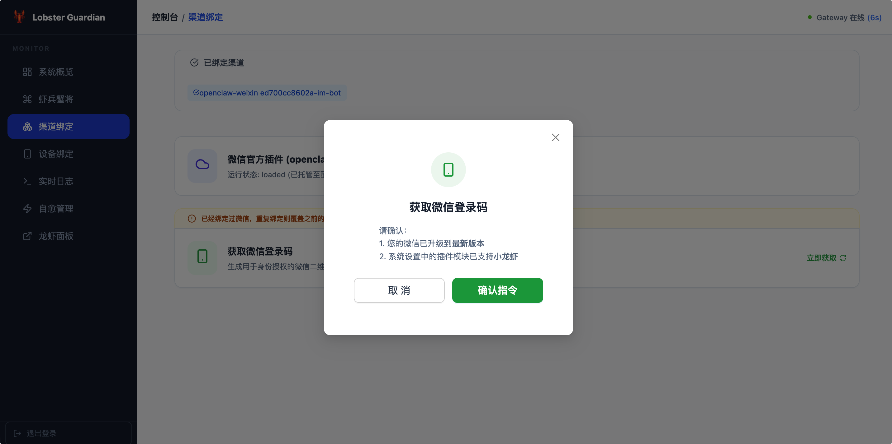
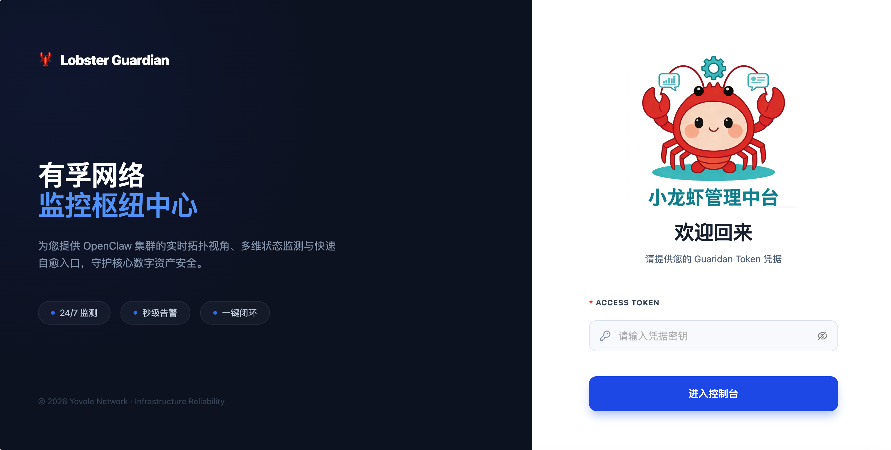
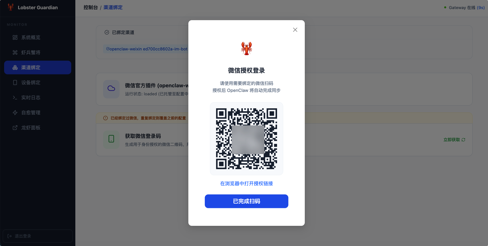

# 🦞 有孚小龙虾带外监控服务 (Lobster Guardian)

[](https://goreportcard.com/report/github.com/yovole/openclaw-monitor)
[](https://opensource.org/licenses/MIT)

**有孚小龙虾带外监控服务 (Lobster Guardian)** 是一个专为 **OpenClaw (小龙虾 AI Agent)** 设计的企业级、全功能带外管理 (Out-of-band Management) 与自愈系统。

---

## 📸 功能预览

| **系统概览 (Dashboard)** | **流式登录 (Get QR)** |
| :---: | :---: |
|  |  |
| **安全登录 (Auth)** | **扫码登录 (Show QR)** |
|  |  |

---

## 📖 项目背景

OpenClaw 是一款强大的个人 AI 代理操作系统。由于其管理接口（Web UI & Channels）深度集成在网关进程中，一旦用户误修改 `openclaw.json` 配置或插件冲突导致网关崩溃，用户将失联。

**Lobster Guardian** 作为“带外哨兵”独立运行，提供实时监控、一键部署、流式登录捕获及自动故障恢复，确保 AI 代理始终在线。

## ✨ 核心特性

- **🖥️ 现代 Web 控制面板**：基于 React + Ant Design + Lucide 开发，支持响应式布局（移动端适配）。
- **🛡️ 智能自愈系统 (Self-Healing)**：
    - **多级回滚**：优先从 `backups/` 目录恢复已知健康的配置快照。
    - **软开关管理**：通过 SQLite 持久化存储自愈开关，支持“仅监测”或“全自动修复”模式。
- **📱 设备中心与授权**：
    - **双态管理**：清晰区分“待处理连接请求”与“已配对合规设备”。
    - **在线批准**：直接通过 Web 界面批准新设备的接入请求。
- **🤖 虾兵蟹将 (Bots/Models)**：自动解析 `openclaw.json`，直观展示当前配置的所有机器人和模型实体。
- **📺 微信插件深度管理**：
    - **一键安装/配置**：自动化执行插件下载与启用配置。
    - **流式登录捕获**：实时监听 `openclaw` 输出，通过流解析实现 **<5s** 的二维码秒出。
- **📊 运行指标可视化**：实时查看 CPU、内存、磁盘负载及响应延迟趋势图。
- **🔗 龙虾面板透传**：集成 Reverse Proxy，直接在 Guardian 界面内安全访问原生 Dashboard。
- **🔔 飞书全能报警**：实时推送故障、自愈及登录交互式卡片消息。

## 🏗️ 系统架构

```text
       [ 浏览器 / 移动端 ]
               │
       [ Guardian Web Server ] (Gin + React)
               │
    ┌──────────┴──────────┐
    │                    │
[ 监控回路 ]         [ 插件/设备管理 ]
    │                    │
- 端口探针 (18789)    - 微信插件流式捕获
- 健康检查请求        - 设备连接授权 (Approve)
- 自动备份/回滚       - SQLite 配置持久化
- 趋势指标入库        - 反向代理 (Native UI)
```

## 🚀 快速开始

### 前提条件
- **Go 1.22+**
- **Node.js 18+** (用于前端编译)
- **OpenClaw** 环境已就绪

### 快速开发与预览
项目提供了一键开发脚本 `dev.sh`：
```bash
# 进入隔离开发模式（编译前端、构建后端、并在独立的 ./temp-dev-test 目录运行）
./dev.sh
```

### 生产部署 (Release)
1.  **执行构建**: `./build_linux.sh` (交叉编译为 Linux)
2.  **获取产物**: 产物位于 `release/` 目录下，解压后上传至服务器。
3.  **参数配置**: 修改 `env` 文件（首次启动会自动生成 16 位随机 `GUARDIAN_TOKEN`）。
4.  **启动服务**: `./start.sh`

## ⚙️ 配置文件说明 (env)

```env
WEB_PORT=3000                 # Guardian 面板端口
GUARDIAN_TOKEN="sk-xxx"       # 访问面板所需的令牌
HEALTH_PORT=18789             # 小龙虾 (OpenClaw) 监听的地址
OPENCLAW_CONFIG_DIR="~/.openclaw" # 配置目录
CHECK_INTERVAL_SECONDS=30     # 监控扫描频率 (秒)
```

## 📄 开源协议

本项目基于 **MIT License** 开源，由有孚网络云枢中台团队维护。
