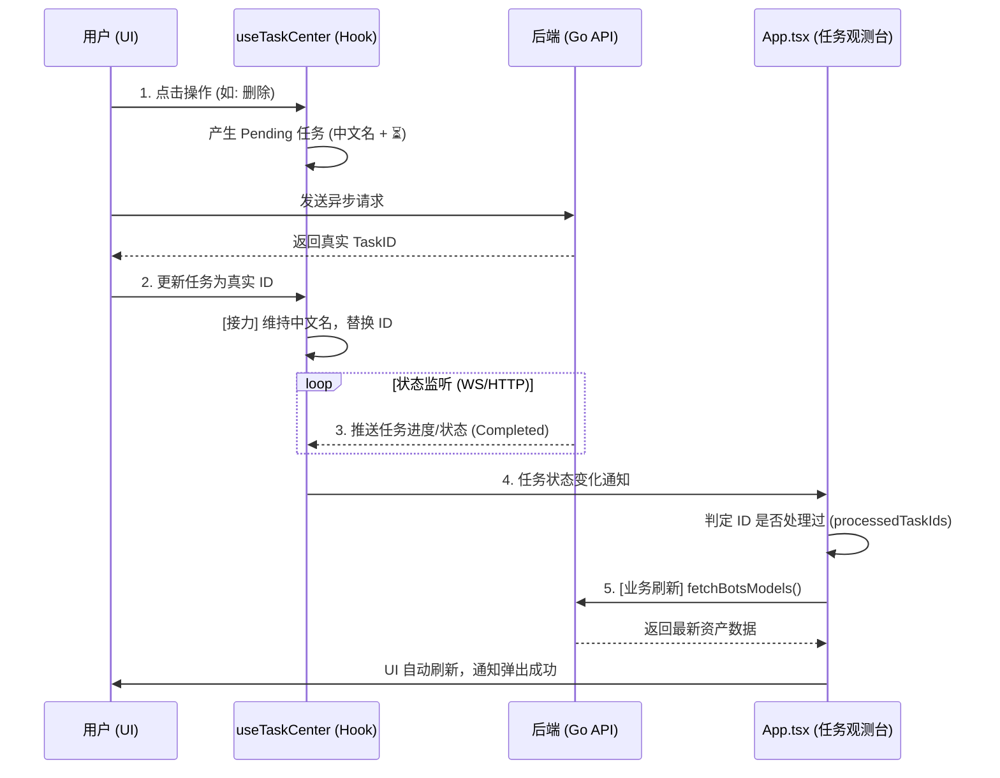

# OpenClaw Buddy - 任务中心架构与副作用观测系统 (Task Management)

本项目采用了一套“任务导向”的前端状态机逻辑。该系统旨在提供零延迟的 UI 反馈、实时的任务进度追踪，并能自动处理跨组件的业务数据同步。

## 1. 系统核心组件

### 1.1 `useTaskCenter` (状态源)
- **定位**：整个前端应用的任务信令中心（Single Source of Truth）。
- **职责**：
    - 管理 `tasks` 状态列表（按时间倒序）。
    - 维护任务的增删改查（添加 Pending 任务、接力替换真实任务）。
    - 隔离 React 重渲染循环（通过 `tasksRef` 解耦依赖）。

### 1.2 `App.tsx` (副作用观测台)
- **定位**：业务刷新指令的中控。
- **职责**：
    - 监听 `activeTasks` 的变化。
    - 追踪并记录已处理的任务 ID (`processedTaskIds`)。
    - 当任务状态切换为 `Completed` 或 `Failed` 时，自动调用相关模块的刷新接口（如：刷新机器人列表、刷新网关状态）。

## 2. 任务流转时序图 (Handover Workflow)

## 3. 任务生命周期 (Lifecycle)

### 2.1 本地发起 (Pending)
当用户触发一个异步操作（如删除机器人）时：
1. 前端立即生成一个虚拟任务 ID (`pending-xxx`)。
2. 调用 `baseUpdateTask` 进行**乐观更新 (Optimistic Update)**。
3. 任务栏立即出现加载项。

### 2.2 无感接力 (Handover)
1. 后端处理完请求，生成真实任务 ID，并通过 WS 或 API 推送给前端。
2. 前端检索当前是否存在 `module/target/action` 匹配的 `pending-` 任务。
3. 如果匹配，执行**平滑接力**：用真实任务 ID 替换 `pending-` ID。
4. **名称保护**：接力时会自动锁定前端定义的中文名称，防止被后端直出的英文文案覆盖，消除文字跳变感。

### 2.3 完成与刷新 (Side Effects)
1. 任务状态更新为 `Completed`。
2. `App.tsx` 观测到任务完成。
3. 如果是首次发现（ID 不在 `processedTaskIds` 中），则触发 `fetchData()` 等业务刷新。

## 3. 关键性能与体验优化

### 3.1 初始加载抑制 (Popup Storm Suppression)
- **问题**：刷新页面时，后端会返回一堆历史已完成任务，如果不加控制，会导致页面刚打开就弹出满屏的旧通知。
- **方案**：
    - `useTaskCenter` 首次静默同步时带上 `skipNotify` 选项。
    - `App.tsx` 在第一次运行监听器时，标记所有已有任务为 `processed`。

### 3.2 依赖循环保护
- **方案**：在 `useTaskCenter` 中完全移除 `tasks` 作为 `useCallback` 的依赖。改用 `setTasks(prev => ...)` 闭包更新和 `useRef` 同步最新状态。这使得即使任务列表每秒更新 100 次，也不会导致 Hook 无限重启。

### 3.3 稳定性监控点
- **WS 依赖**：目前系统主要依赖 WebSocket 推送状态。
- **静默刷新**：业务刷新（如 `fetchBotsModels(true)`）现在只在任务“状态由变”时触发一次，极大地保护了服务器资源。

## 4. 开发指引 (如何增加新任务)
如果你需要为新功能增加异步任务追踪：
1. 在 `App.tsx` 对应的业务函数中，点击时先调一次 `baseUpdateTask` 生成 `pending` 态。
2. 在 `App.tsx` 的 `useEffect` 观测台中，为该 `module` 增加对应的刷新逻辑。
3. 确保后端 API 返回的任务包含正确的 `module`, `action` 和 `target` 指向。

## 4. 模块触发器与业务刷新 (Module Triggers)

系统通过 `App.tsx` 中的观测效果器（Task Observer）实现业务自动刷新。以下是各子模块的动作对照表：

| 模块名称 (`module`) | 常见任务场景 | 触发的刷新函数 | 刷新后的 UI 表现 |
| :--- | :--- | :--- | :--- |
| **`gateway`** | 重启、停止、启动 | `fetchData()`, `fetchSystemEvents()` | 顶部状态栏、健康趋势图、实时巡检流同步更新。 |
| **`bots`** | 创建/删除机器人、身份编辑 | `fetchBotsModels(true)` | “虾兵蟹将”页面的机器人卡片即时刷新，状态重载。 |
| **`plugins`** | 安装/卸载、检查更新 | `fetchPlugins()` | “技能管理/插件管理”页面的表格数据即时重新同步。 |
| **`wechat`** | 微信插件安装 | *(由 `bots`/`plugins` 合并处理)* | 到位后，相关授权按钮变为启用状态。 |

---
*文档更新日期: 2026-03-31*
