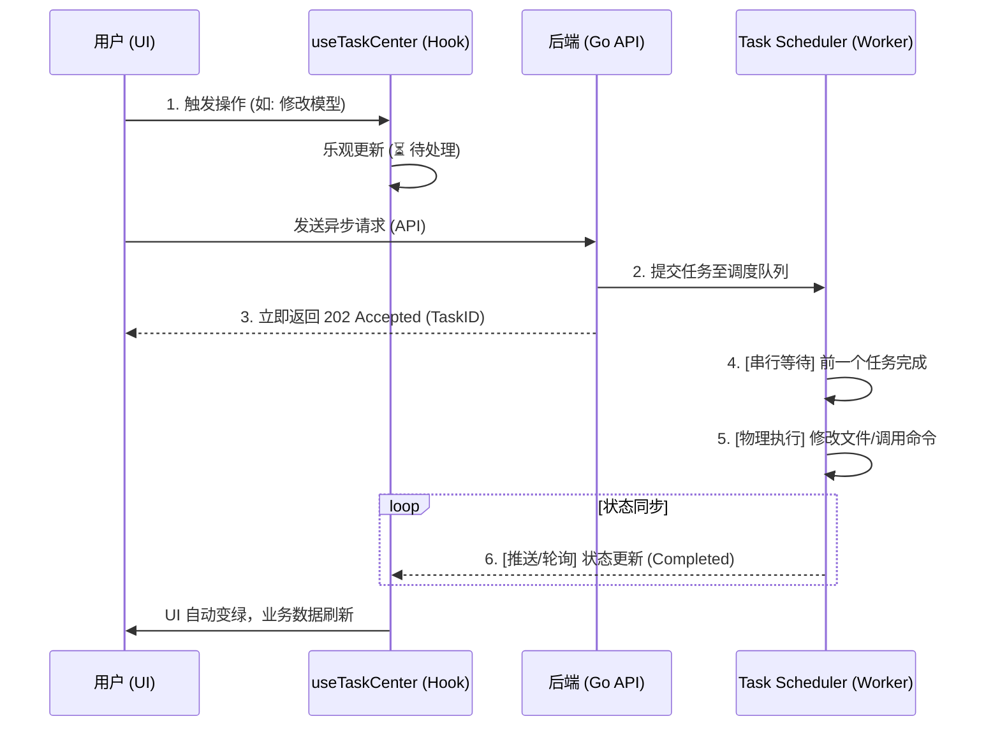

# OpenClaw Buddy - 任务中心架构与副作用观测系统 (Task Management)

本项目采用了一套“任务导向”的分布式/串行化执行模型。该系统旨在提供零延迟的 UI 反馈、实时的任务进度追踪，并能通过物理串行调度杜绝并发读写冲突。

## 1. 核心架构：三级优先级串行调度器 (Serial Task Scheduler)

为了彻底解决配置文件（如 `openclaw.json`）在并发更新时的 `409 Conflict` 冲突，本项目引入了全局单例调度引擎：

### 1.1 物理串行执行 (Single Worker)
- **原理**：系统维护两个任务队列（高优/常规），但底层仅由一个 **Single Worker协程** 进行消费。
- **一致性保证**：确保同一时间只有一个修改配置或控制网关的操作在运行，从物理层面隔离了 IO 竞争。

### 1.2 优先级体系
- **PriorityHigh (网关级)**：包括启动、停止、重启网关的操作。这类任务具有“插队”属性，优先于普通配置修改执行。
- **PriorityNormal (配置级)**：包括修改机器人名称、模型、增删机器人等操作。遵循 FIFO（先进先出）原则排队执行。

## 2. 后端执行流程 (Handover Workflow)

## 3. 前端实时性与同步机制 (Side Effects)

### 3.1 乐观更新与接力 (Optimistic Handover)
- 前端立即生成虚拟 ID (`pending-xxx`) 让 UI 瞬间响应。
- 当收到后端真实 ID 后，执行平滑接力，通过 `updateTask` 闭包更新状态，防止 React 无限渲染。

### 3.2 自动巡检兜底 (Auto-Sync Polling)
- **8秒静默巡检**：`useTaskCenter` 内置了一个每 8 秒触发一次的后台轮询，用于主动向 `/v1/tasks/status` 对账，防止 WebSocket 丢包导致的 UI 状态卡死。

## 4. 系统韧性：自愈避让逻辑 (Guardian Yielding)

### 4.1 意志让步原则
- **场景**：当 `Guardian` 守护进程检测到需要自愈（故障中）时，会先检查任务调度器的状态。
- **避让**：如果检测到用户有手动操作网关的意图（排队中或执行中），`Guardian` 将 **跳过本次自愈**，防止与用户的手动操作产生资源抢占或状态回退。
- **审计**：避让情况会记录进系统事件流中，供运维回溯。

## 5. 模块触发器与业务刷新标准 (Standardized Triggers)

本项目遵循“任务落地即物理对账”原则。`App.tsx` 中的 **全局任务观察器 (Global Observer)** 负责在任务状态变为 `Completed` 时静默触发以下业务刷新：

| 模块名称 (`module`) | 优先级 | 常见任务动作 (`action`) | 自动触发的业务刷新 (Fetch Action) |
| :--- | :--- | :--- | :--- |
| **`gateway`** | **High** | `start`, `stop`, `restart` | `fetchData()`, `fetchSystemEvents()` |
| **`bots`** | Normal | `add-model`, `delete-model`, `set-default-model`, `add-provider`, `clone-expert` | **`fetchModelsConfig()`**, **`fetchBotsModels(true)`** |
| **`plugins`** | Normal | `install`, `uninstall`, `update` | `fetchPlugins()` |
| **`skills`** | Normal | `delete-skill`, `sync-skills` | **`fetchSkills(true, true)`** (静默对账) |

## 6. 前端闭环：静默对账机制 (Silent Reconciliation)

为了提供极致流畅的交互体验，本项目在 v1.3 更新中确立了以下 UI 准则：

1. **乐观响应 (Optimistic UI)**：删除/禁用类操作应在请求发出后立即通过本地 State 进行视觉隐藏，无需等待任务完成。
2. **任务静默 (Silent Success)**：异步任务成功后，系统执行静默数据拉取（不弹出“资产同步成功”提示），除非发生物理错误。
3. **全局对账 (Top-Down Sync)**：所有的业务刷新指令由顶层 `App.tsx` 统一分发，子组件（如 `SkillManagement`）不再自行维护任务监听，确保全系统 **最终一致性**。

## 7. 后端实现指南 (Implementation Reference)

为了避免项目重构导致的坐标迷失，开发者应优先参考以下核心路径：
- **API 路由器**: `internal/api/router.go` (负责路由分发与任务注入)
- **业务处理器**: `internal/api/handlers.go` (所有的 `runAsyncTask` 逻辑均在此物理固化)
- **任务定义**: 技能相关任务必须使用 `skills` 模块标识，以触发 `App.tsx` 的全局副作用。

---
*文档更新日期: 2026-03-31 (v1.3 Skill Sync standardization Update)*
