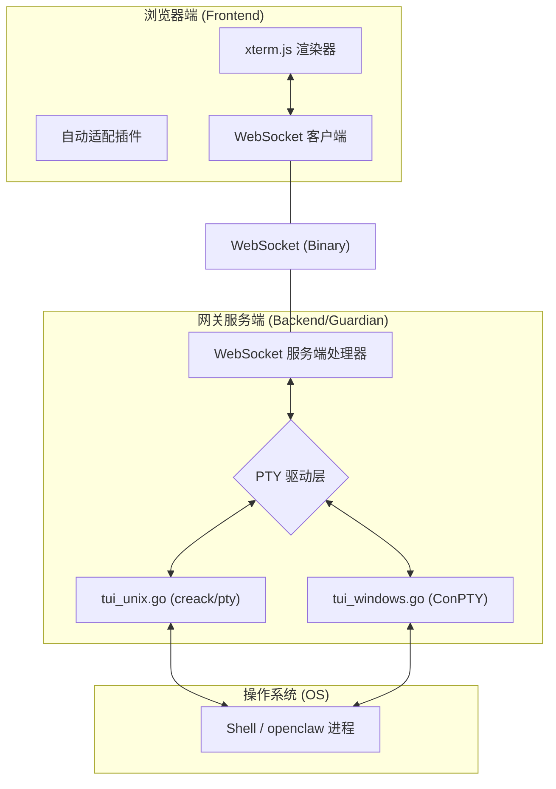

# OpenClaw Buddy 终端与 TUI 架构设计文档

## 1. 系统概述

OpenClaw Buddy 提供了两种形式的终端交互能力：
1.  **TUI 聊天**: 通过 Web 执行 `openclaw tui` 命令，提供基于终端 UI 的交互式助手体验。
2.  **运维终端 (Maintenance Terminal)**: 为运维人员提供直接访问宿主机 Shell（如 bash, zsh, cmd, powershell）的能力，便于即时排查系统问题。

本文档旨在阐述该功能背后的技术实现方案、跨平台处理机制以及通讯原理。

## 2. 整体架构

系统采用 **xterm.js + WebSocket + PTY** 的经典架构，实现了浏览器端与服务器端进程的实时、双工、原始模式通讯。

## 3. 关键技术方案

### 3.1 前端渲染 (xterm.js)
*   **渲染核心**: 使用 `xterm.js` 生成工业级的终端布局，处理 ANSI 转义序列（颜色、光标移动等）。
*   **自动适配**: 集成 `xterm-addon-fit` 插件。前端监听浏览器窗口视口变化，动态计算终端的列数（Cols）和行数（Rows），并通过 WebSocket 发送 `resize` 指令给后端。
*   **二进制流**: WebSocket 设为 `arraybuffer` 模式。后端发来的 PTY 原始字节流直接通过 `term.write()` 渲染，确保零转换损耗。

### 3.2 传输协议
通讯通过单个 WebSocket 连接完成，支持两种消息类型：
1.  **控制消息 (JSON)**: 
    *   用于同步终端尺寸：`{"type": "resize", "cols": 80, "rows": 24}`。
2.  **字节流 (Binary)**:
    *   用户按键输入：直接将按键的原始 ASCII/UTF-8 字符发往后端。
    *   进程输出：将 PTY 的原始输出流透传至前端。

### 3.3 后端 PTY 驱动
后端通过 **伪终端 (Pseudo-Terminal, PTY)** 启动目标进程。相比于标准的 `stdin/stdout` 管道，PTY 的优势在于：
*   **交互感知**: 允许进程识别自己运行在终端环境下（如启用色彩、支持 `vi`/`top` 等全屏工具）。
*   **流控处理**: 处理特殊的控制字符（如 `Ctrl+C`, `Ctrl+Z`）。

## 4. 跨平台支持机制 (Cross-Platform)

为了使 OpenClaw Buddy 成为一个真正的全平台工具，我们对底层 PTY 引擎进行了抽象，通过 Go 的 `//go:build` 编译标签实现了不同系统的适配。

### 4.1 Unix 架构 (macOS / Linux)
*   **核心库**: `github.com/creack/pty`。
*   **原理**: 基于 Unix 系统调用 `os.ForkExec`，通过 `/dev/ptmx` 和 `/dev/pts/X` 进行通讯。
*   **文件锁**: 使用 `syscall.Flock` 实现单实例运行保护。

### 4.2 Windows 架构 (Windows 10+)
*   **核心库**: `github.com/aymanbagabas/go-pty` (底层封装了 Windows 原生的 **ConPTY** API)。
*   **原理**: Windows 历史上不支持 PTY，但在 1809 版本后引入了 `CreatePseudoConsole` 接口。我们的实现通过该原生接口，确保了在 Windows 下运行 `.bat` 或 `.exe` 时能获得类似 Linux 的流畅终端体验。
*   **文件锁**: 使用 Windows API `LockFileEx` 实现全平台一致的文件锁定机制。

## 5. 性能与交互优化

1.  **异步读取**: 后端分别为 WebSocket 读取和 PTY 输出读取开启独立的 Goroutine，确保输入和输出互不阻塞。
2.  **环境注入**: 在启动终端进程时，后端会自动注入当前用户的家目录（`HOME` / `USERPROFILE`）以及 OpenClaw 专属的环境变量（`OPENCLAW_CONFIG_DIR`），确保 `openclaw` 命令能正确读取配置。
3.  **Shell 智能检测**: 
    *   Windows 优先使用 `%COMSPEC%` 指向的 shell。
    *   Unix 优先使用系统默认的 `$SHELL` 或常见的 `zsh`/`bash`。

## 6. 配置与部署相关

*   **工作目录**: 终端启动后的工作目录默认为用户的家目录。
*   **权限控制**: 所有通过 WebSocket 建立的终端连接都必须经过 `guardian_token` 头部或参数校验，防止未授权访问系统 Shell。
