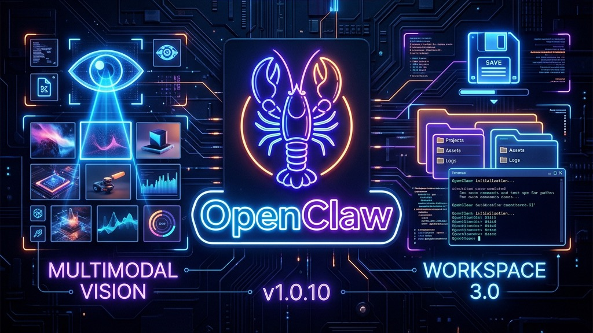
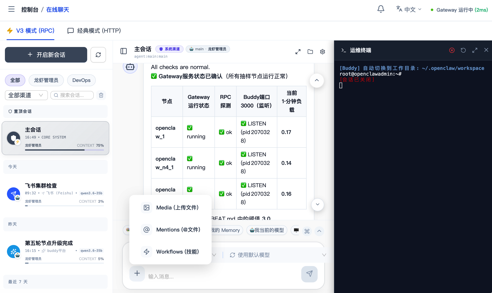
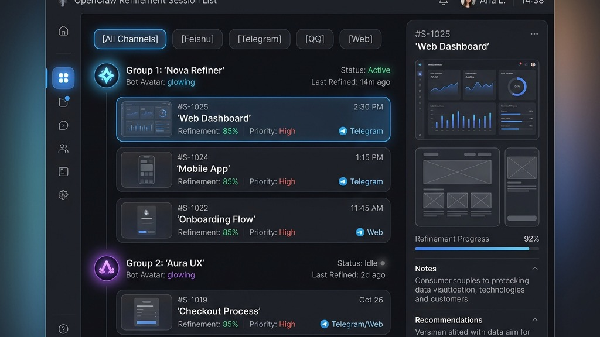

# 🎷 OpenClaw Buddy v1.0.10: 对话即工作，沉浸式协同新纪元

> “我曾经听人说过，当一个工具不再只是工具，它就成了一种记忆。
>
> 1.0.9 的时候，我们还在讨论视界的边界；到了 1.0.10，我发现边界其实并不存在，存在的只有‘沉浸’。
>
> 当你敲下一个 `@`，就像是在人群中精准地唤醒一个老友的名字，那一刻，对话不再是对话，它成了工作，成了生活。
>
> 有人说，最远的距离是对话与代码的距离。但在 1.0.10 的工坊里，距离缩短到了一个 CLI 窗口，一个保存按钮。我们不再只是在‘看见’，我们是在‘共生’。
>
> 五月一日，在这个被定义的时刻，感官觉醒，协同不再孤独。”

> **版本版本 (Version)**: v1.0.10
> **发布日期 (Date)**: 2026-05-01
> **基准代码 (Base)**: `8484b46f`
> **当前提交 (Commit)**: `aac3775b`
> **核心主题**: 对话即工作、智能上下文 (@Mention)、命令行集成 (CLI)、极致性能调优。

---

## 🚀 新增特性 (New Features)

### 1. 多模态视界 2.0：从“看见”到“洞察” 👁️

Buddy 对世界的感知不再局限于文字。现在，它是你处理复杂多模态任务的最佳搭档。

* **图片粘贴与即时分析**: 支持在聊天框直接粘贴图片（Cmd+V），并自动触发多模态视觉模型进行深度解析。
* **强制语言对齐**: 针对图片与文件分析指令进行了全量优化，强制 AI 使用中文进行回复，确保沟通的零隔阂。
* **多维预览矩阵**: 文件浏览器新增对 **Word、Excel、PDF、Image** 的直接在线预览，无需下载即可洞察内容。
* **💡 大白话：** 以后截图直接往聊天框一贴就能问它，它看得更清楚了，而且一定会用中文回你。想看文件夹里的文档或图片，直接点一下就能预览，不用下载。

### 2. Bot 工作区 3.0：AI 驱动的沉浸式协同工坊 🛠️

不再只是冰冷的文件管理器。我们将 **Cursor 级的 IDE 交互体验** 搬进了 Buddy 的聊天流，让“对话”即“工作”。

* **智能上下文唤起 (@Mention)**: 支持在聊天中使用 `@` 语法直接引用 **文件、文件夹或 Skills 资源**。AI 将瞬间理解你的项目脉络，提供更具针对性的建议。
* **灵感即时固化**: 聊天中生成的任何代码、文档或配置，配合全新的 **悬浮保存按钮**，可一键同步至 Bot 工作区。
* **命令行深度共生 (CLI)**: 无需离开对话界面，即可一键唤起终端执行指令。配合文件树的右键管理功能，实现从调试到部署的全流程闭环。
* **💡 大白话：** 现在你可以在聊天里用 `@` 像点名一样引用文件夹或技能，机器人就像你的同事一样懂你的项目。AI 写出的好东西点一下就能存进它的“脑子里”，还能直接弹窗跑命令行，效率直接拉满。

### 3. 全平台交互打磨：每一个像素都有温度 🎨

我们重新审视了每一个 UI 细节，确保在不同终端下都能提供一致的尊贵体验。

* **会话 ID 全量展示**: 在 Web 端不再隐藏或缩略会话 ID，支持完整显示与一键复制，方便开发者进行精准调试。
* **智能分组过滤**: 会话列表现在支持按 Bot 和渠道进行双重过滤分组，即使管理上百个会话也能井般有序。
* **移动端布局重塑**: 针对移动端进行了专项优化，将搜索框上移至标题栏，大幅提升了小屏幕下的内容展示空间。
* **反馈生态闭环**: 侧边栏与概览页新增“反馈邮箱”图标，一键唤起邮件客户端或复制反馈地址，让你的建议直达核心团队。
* **💡 大白话：** 手机上用起来更宽敞了，找对话时可以按机器人分类。如果你觉得哪里不好用，点一下旁边的信封图标就能给我们发邮件。

---

## 🛠️ 稳定性与一系列优化 (Optimizations & Fixes)

在 1.0.10 的代码中，我们埋下了数百个细小的改进，只为那一丝更稳健的运行。

### 1. 性能“脱胎换骨” ⚡

* **上传性能爆发**: 深度优化了聊天附件的上传链路，彻底解决了大文件上传时可能导致的 504 Gateway Timeout 挂起问题。
* **思考计时同步**: 引入了 `_thinkStartedAt` 时间戳同步机制，修复了在流式更新时 AI 思考计时器被意外重置的问题，让“它在想什么”更透明。
* **引用清洗逻辑**: 优化了消息引用功能，自动清洗掉思考过程与工具调用的冗余元数据，让引用回复更清爽。

### 2. 协议与容错 🛡️

* **ECharts 深度容错**: 增强了图表渲染的容错性，支持自动修复带 JS 前缀、未闭合括号及夹杂文本的配置信息。
* **超长指令适配**: 针对重型插件（如 oh-my-openclaw），将相关指令的超时时间大幅增加（如扫码登录增加至 90s），确保操作不因网络或系统负载而中断。
* **剪贴板后备方案**: 增强了“复制绝对路径”和“复制消息内容”的兼容性，针对非安全上下文（非 HTTPS）添加了 `execCommand` 后备方案。

### 3. 细节修复清单 🔧

* **样式隔离**: 修复了文件夹浏览器导致的全局 Markdown 样式污染问题，确保各组件样式独立。
* **对齐修复**: 修复了文件浏览器侧边栏图标与名称微小的像素偏移，追求视觉上的绝对严谨。
* **状态同步**: 优化了 Dashboard 初始状态显示，增加了灰色的“连接中”状态并自动禁用非就绪状态下的操作按钮。

---

---

## 📄 变更清单 (Commit Log)

| 简写 | 描述 |
| :--- | :--- |
| aac3775 | docs: 添加 PR 描述规范模板 |
| 63d397f | feat: 在侧边栏和概览页添加反馈邮箱图标并实现点击复制功能 |
| f947a40 | perf(v3): 优化右侧面板拖动手感，禁用拖动时的过渡动画并扩大手柄热区 |
| b911ef9 | fix(v3): 修复文件夹浏览器导致的样式污染，隔离 markdown 样式类名 |
| 4a00bb0 | feat(chatV3): 完善运维终端 Modal 与设置项集成 |
| 6390598 | feat(chatV3): 优化工作区布局与侧边栏交互 |
| 3c4b9c2 | fix: 修复文件浏览器侧边栏和列表项中图标与名称未对齐的问题 |
| 8d7c19b | feat: 增强 AI Chat 多模态能力及文件管理体验 |
| f38b8c2 | feat(chat): 优化会话列表支持按 Bot 及渠道双重过滤分组 |
| f82642a | fix(ui): 修复在 skills 文件浏览中预览 markdown 文件时缺失滚动条的问题 |
| f284a0f | feat(FileExplorer): 优化编辑器界面交互，新增悬浮保存按钮并补全国际化词条 |
| c614521 | style: 在 Web 端完整显示会话 ID，取消长度限制 |
| 9705615 | feat: 优化 Chat V3 全屏模式健康指示器位置，并修复消息复制按钮在非安全上下文下的兼容性问题 |
| e7c6518 | fix: 增强文件浏览器“复制绝对路径”功能的兼容性，添加剪贴板后备方案 |
| f12caef | fix: 完善图片能力拦截逻辑与判定稳定性 |
| 27ddc48 | feat: 优化图片/文件分析指令，强制使用中文回复 |
| 45679c6 | perf: 进一步优化图片查看性能，并测试原图预览模式 |
| 3be68f1 | perf: 深度优化聊天上传性能，修复 504 挂起问题 |
| e64d526 | feat: 增强多模态能力可视化与交互体验，优化图片上传性能 |
| bb0c67d | fix(chat): 修复 AI 思考计时器在流式更新时被重置的问题，使用 _thinkStartedAt 时间戳同步计时 |
| 20373e8 | ui: 优化 Dashboard 初始状态显示，增加灰色‘连接中’状态并禁用操作按钮 |
| f1cd668 | feat: 优化 V3 聊天消息引用功能，自动清洗思考过程与工具调用元数据 |
| 3861cc4 | revert(v3): 还原消息渲染到 e10047c 逻辑 |
| 2a028f5 | feat(chat): 优化 V3 聊天思考反馈、支持图片粘贴及会话列表 Bot 名称显示 |
| a422788 | fix(v3): 修复会话总结接口404问题，优化思考与工具调用的实时反馈逻辑 |
| 124106c | fix(web): 生成会话标题接口 404 自动回退 |
| 938968a | fix(chatV3): 首次进入按会话自动对齐 bot |
| e10047c | feat(chatV3): 分析过程默认展开并支持复制 |
| 2e19d73 | feat: 文件创建支持初始内容并优化工具回执展示 |
| 7f15c5d | feat: 文件浏览器增加侧边栏收缩功能，优化大屏展示空间 |
| c554325 | fix: 修复文件浏览器右键菜单位置偏移问题，使其在鼠标点击处显示 |
| 12144f6 | feat: V3 聊天界面增加 Bot 工作区文件浏览器，支持右键复制绝对路径 |
| 1195981 | feat: 优化文件浏览器，支持 Word/Excel/PDF 预览及右键新建文件/文件夹功能 |
| 024fa11 | fix(chatV3): 切换会话时补全未命名会话标题 |
| 38b8a5b | feat(chat-v3): 优化消息来源识别与子代理视觉呈现，修复历史记录数据污染过滤逻辑 |
| 85c1b86 | fix(file-explorer): 修复图片文件无法预览的问题，增加图片格式识别与二进制流渲染 |
| d05eef9 | feat(chatV3): 增强会话名称保护逻辑，优化消息面板系统信息过滤，新增会话分析工具 |
| 63477ce | feat(chart): 增强 ECharts 渲染容错性，支持处理带 JS 前缀、未闭合括号及夹杂文本的配置 |
| e79188f | fix(timeout): 大幅增加 openclaw 相关指令的超时时间 |
| 5b71ce6 | feat(ui): 优化移动端文件浏览器布局，将搜索框移动至标题栏 |
| 7b3c4db | feat: 将异步任务及聊天代理超时时间从 3 分钟调整为 6 分钟 |
| 89fa844 | style: 优化文件浏览器移动端导航与尺寸 |
| fb5aea7 | feat(chat): 优化 v3 聊天 ECharts 流式渲染 |
| c331ebe | feat: 支持 :::analysis 自定义分析标签 |

## 📦 发布产物 (Release Artifacts)

* 🐧 **Linux (amd64)**: `openclaw-buddy-linux-1.0.10.tar.gz`
* 🍎 **macOS (Universal)**: `openclaw-buddy-mac-1.0.10.tar.gz`

🔗 **下载地址**: [GitHub Releases v1.0.10](https://github.com/RandyChen1985/openclaw-buddy/releases/tag/1.0.10)

---

## ❤️ 特别致谢

感谢每一位在 GitHub 和邮件中提交反馈的 Buddy。你们的每一条 Bug Report 都是我们进化的养料。

> “感知的觉醒，是为了让机器更像同伴，让创造不再孤独。”

---
