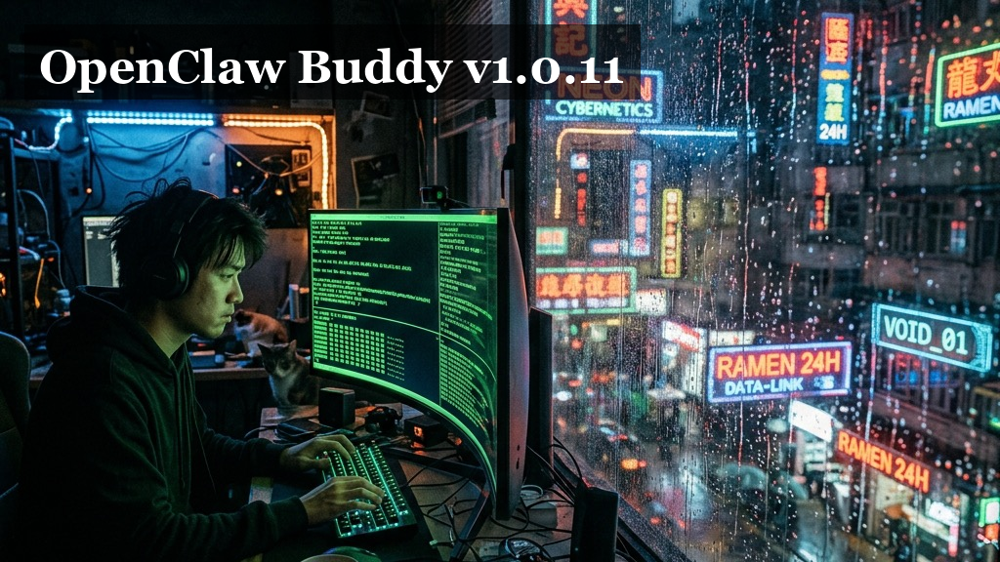

# 🎨 OpenClaw Buddy v1.0.11: 细节觉醒，于无声处听惊雷

> “有些人觉得，改变是为了让人适应环境。但对我来说，改变是为了让环境适应人。
>
> 1.0.11 的工坊里，我们不再谈论宏大的叙事，我们谈论的是那一丝拖动的顺滑，是深夜里那一抹深邃的暗，是跨越语言时的那份坦然。
>
> 当窗口可以随心而动，当色彩在暗夜里流转，那一刻，我才感觉到这个空间是属于我的。
>
> 我们在追求一种‘无感’——无感的切换，无感的对齐，无感的守护。
>
> 有些东西，不用说，它就在那里。就像那 70 多个补全的词条，跨越了语言，只为了那一份默契。
>
> 五月六日，细节觉醒，于细微处见众生。”

> **版本 (Version)**: v1.0.11
> **发布日期 (Date)**: 2026-05-06
> **基准代码 (Base)**: `220ffbb`
> **当前提交 (Commit)**: `ddf1257`
> **核心主题**: 交互布局进化、全局视觉统一、全量国际化补全、系统健壮性加固。

---

## 🚀 新增特性 (New Features)

### 1. 全局视觉审美统一：深邃暗黑之美 🎨

美，是不分角落的。我们对 Web 端进行了全方位的审美重塑，确保每一个像素都流淌着统一的设计语言。

*   **全场景暗色补齐**: 彻底补齐了 Web 全局暗色模式，确保与 Chat V3 的沉浸式体验完全一致，深夜码字不再刺眼。
*   **品牌与菜单和谐**: 统一了侧边栏品牌区与子菜单的样式，消除了视觉上的割裂感。
*   **环境标签重塑**: 运行状态的环境 Tag 进行了样式统一，移动端实现左对齐。为了界面更清爽，环境标签现在常驻于运行状态条，侧栏不再显示冗余信息。
*   **💡 大白话：** 现在整个网页的暗黑模式都对齐了，看着更高级。侧边栏没用的标签藏起来了，放到了底部的状态条里，移动端看着也整齐多了。

### 2. 随心而动的交互空间：灵动布局 3.0 🗄️

我们将控制权彻底交还给用户。现在，你的工作区不再是固定的格子，而是可以呼吸的灵感画布。

*   **窗口自由迁徙**: 文件浏览器与终端窗口现在支持全量**拖动移位**。你可以根据当前的任务流，随意调整它们的位置，打造最顺手的 IDE 布局。
*   **布局深度联动**: 优化了 V3 聊天界面的布局联动逻辑，彻底解决了 Mention 弹窗在搜索时的闪动问题，以及终端/文件浏览器在最大化切换后的位置偏移。
*   **编辑效率补完**: 文件编辑器右下角新增 **「复制全部内容」** 悬浮按钮，让代码搬运与分享更在一瞬之间。
*   **💡 大白话：** 现在的弹窗和窗口可以像在桌面一样随便拖来拖去了。以前那个点名（Mention）弹窗闪烁的问题也修好了。编辑器里还加了个“一键复制全部”的按钮，挺方便的。

### 3. 无国界沟通：70+ 词条全量补全 🌐

我们相信，好的工具不应该有语言的隔阂。

*   **英文词条大爆发**: 针对英文环境，全量补齐了 **70 多个** 缺失的国际化词条，覆盖了从设置到复杂交互的每一个角落。
*   **测试驱动质量**: 在补全翻译的同时，同步更新了 `tests/CHECKLIST.md` 自动化测试清单，确保国际化质量的长治久安。
*   **💡 大白话：** 我们把之前漏掉的英文翻译全给补上了，足足 70 多个地方。现在用英文版也不会看到莫名其妙的中文了。

---

## 🛠️ 稳定性与一系列优化 (Optimizations & Fixes)

我们在底层进行了一场“静默革命”，让 Buddy 运行得更稳、更懂你。

### 1. 逻辑与渲染优化 ⚡

*   **消息过滤精度**: 修复了 `visibleMessages` 中 `useMemo` 缺少 `isTyping` 依赖的问题，彻底解决了流式输出时可能出现的消息过滤错误。
*   **状态同步优化**: 优化了 V3 会话状态同步机制，通过忽略 `sessions.changed` 的特定相位，避免了在高并发操作下的误锁/释锁问题。

### 2. 系统自愈与健壮性 🛡️

*   **Guardian 自愈增强**: Guardian 模块新增避让逻辑，现在会智能避让 `openclaw-doctor` 诊断进程及 npm 安装过程，防止自愈动作意外干扰系统维护。
*   **文档与元数据修复**: 修复了 README 中的徽章链接，替换了误导性的构建状态图标，确保项目门面真实可信。

---

## 📄 变更清单 (Commit Log)

| 简写 | 描述 |
| :--- | :--- |
| ddf1257 | feat(web): 运行状态环境 tag 移动端左对齐与图标样式统一 |
| 38474e4 | feat(web): 环境标签迁至运行状态条，侧栏不再显示 |
| ca67825 | fix(guardian): 自愈避让 openclaw-doctor 与 npm 安装 openclaw |
| c95c590 | docs: README 徽章指向正确仓库并替换误导性构建徽标 |
| 247cbc8 | fix(v3): 忽略 sessions.changed 的 message 相位避免误锁释锁 |
| 3bc1256 | fix(web): 侧栏品牌区与子菜单样式统一 |
| 694e339 | fix(web): 移动端布局与暗色底统一 |
| 0fe9f6d | fix(web): Web 全局暗色与 V3 体验统一补齐 |
| f21614f | feat: 补全 70+ 个缺失的英文国际化词条，并同步更新自动化测试清单 |
| ff83c5d | 优化：完善 v3 聊天界面布局联动与弹窗交互体验 |
| d8a9d64 | 修复：v3聊天mention弹框搜索闪动及终端/文件浏览器最大化后位置偏移问题 |
| 9f0459f | feat(文件浏览器): 编辑器右下角新增「复制全部内容」浮标按钮 |
| 0bbbdd6 | fix: 修复 visibleMessages useMemo 缺少 isTyping 依赖导致消息过滤错误的 bug |
| 220ffbb | feat: 文件浏览器和终端窗口支持拖动移位 |

---

## 📦 发布产物 (Release Artifacts)

* 🐧 **Linux (amd64)**: `openclaw-buddy-linux-1.0.11.tar.gz`
* 🍎 **macOS (Universal)**: `openclaw-buddy-mac-1.0.11.tar.gz`

🔗 **下载地址**: [GitHub Releases v1.0.11](https://github.com/RandyChen1985/openclaw-buddy/releases/tag/1.0.11)

---

## ❤️ 特别致谢

感谢那些在代码深处默默探索的 Buddy。每一个提交，都是为了更完美的明天。

> “细节的完美，是对极致的最后坚持。”

---
