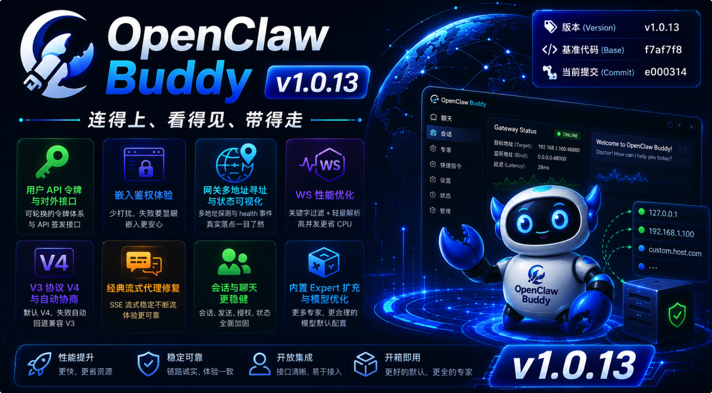

# 🌐 OpenClaw Buddy v1.0.13：连得上、看得见、带得走

> “网关不在本机时，最怕的是『以为在线』；嵌入到别人的页面里，最怕的是『一声不响地失败』。
>
> 这一版里，我们把寻址、探针与状态对账拧成一股绳：bind 与自定义 Host 能被读懂，多地址探测与 health 事件把真实落点告诉前端；WebSocket 代理在洪流里学会『只对关键字动刀』，CPU 不再被 JSON 淹没。
>
> 与此同时，系统用户有了可轮换的 API 令牌与对外签发接口，Bot 授权与建号拆成清晰的两步；V3 侧协议抬到 V4，却在握手失败时悄悄退回兼容路径；经典模式的流式代理补上了早该在的 defer——空 SSE 不再是玄学。
>
> 五月过半，我们把『链路诚实』写进默认路径。”

> **版本 (Version)**: v1.0.13  
> **发布日期 (Date)**: 2026-05-16  
> **基准代码 (Base)**: `f7af7f8`  
> **当前提交 (Commit)**: `e000314`  
> **核心主题**: 用户 API 令牌与对外签发、嵌入鉴权体验、网关多地址寻址与 WS 性能、V3 协议 V4 与协商、经典流式代理修复、会话列表与会话操作稳健性。

---

## 🚀 新增特性 (New Features)

### 1. 用户 API 令牌、对外接口与 Bot 授权拆分 🔑

* **数据库与登录**：`users.api_token`；中间件与 `/login` 识别 `buddyu_` 前缀令牌；管理端支持生成、复制、重置与登录链接。
* **对外 API**：`POST /v1/getUserToken`（adminToken 校验，按用户名返回 token 与 `bot_ids`）；`POST /v1/createUserToken`（不存在则创建 `user` 角色并签发；支持姓名等字段）；`POST /v1/assignUserBot` 独立承担 Bot 绑定，与建号解耦。
* **文档**：`API.md` 同步鉴权说明、curl 示例与字段表。
* **💡 大白话：** 给集成方一把『可轮换的钥匙』，谁在哪个 Bot 上有权限，接口层能说清楚、改得动。

### 2. 嵌入场景：少打扰、失败要显眼 🖼️

* **静音成功提示**：`?embed=true` 时不再弹出「自动登录成功」顶栏 message，避免宿主页面噪音。
* **令牌失败全屏遮罩**：嵌入且 URL token 校验失败时直接无权限遮罩，不再误进登录页。
* **用户表**：真实姓名 / 角色列收紧，操作列加宽，便于日常运维。
* **💡 大白话：** 嵌进去时，成功别嚷嚷，失败别把人领到登录页兜圈子。

### 3. 网关寻址、状态展示与 WebSocket 性能 🛰️

* **配置兼容**：解析 `openclaw.json` 的 `bind`、`customBindHost`，并向前兼容 Buddy 的 `host`；候选地址按 `127.0.0.1` → 自定义 Host 降级探测。
* **health 事件**：向前端注入实际连接目标（`target` / `port`）；端口为 0 或未配置时回落 `HEALTH_PORT`，与 HTTP / WS 代理行为对齐。
* **WS 代理性能**：对高频帧做字节级关键字过滤后再 JSON 解析，降低流式场景 CPU 占用；多地址存活性扫描与 `internal/process` 寻址逻辑统一，Guardian 与状态接口一致。
* **前端对账**：WS 异常断开即时触发 HTTP 状态查询；握手 / 重连以 `gateway.status` 为前提；Dashboard 状态与 `deriveGatewayState` 统一；Tooltip 结构化展示监听地址与延迟。
* **💡 大白话：** 网关绑在物理 IP 上时少误报「已停止」；状态栏告诉你『连的是谁、延迟多少』，而不是一个笼统的绿点。

### 4. V3：WebSocket 协议 V4 与版本协商 📡

* **协议**：前端默认尝试 V4；失败时根据网关反馈自动降级 V3；签名载体与网关校验器对齐（v3 签名格式）。
* **工具与文档**：`tests/manual` 下 Go 调试脚本与协议手册同步 V4 / 签名说明。
* **💡 大白话：** 新网关用 V4，老环境还能自动聊回去，不必手工改两处配置。

### 5. 经典聊天欢迎区与快捷指令 ✨

* **欢迎页**：渐变卡片、悬停效果；embed 下隐藏刷新；移除默认 mascot / 默认图标；窄屏双列紧凑布局与文案截断优化。
* **快捷指令**：管理弹窗两列布局；「当前指令」可折叠（移动端默认折叠），折叠时显示条数提示；系统预置指令右上角 `SYS` 斜角丝带（深浅主题）；i18n 补全。
* **💡 大白话：** 空态更好看、更好管，手机上也不会一排卡片把页面撑爆。

### 6. 内置 Expert 与模型默认值 📚

* **专家包**：新增 `customer_success`、`data_analyst`、`meeting_facilitator`、`product_manager`、`prompt_coach`、`ux_researcher` 等；修正 `live_stream_coach` 字段；新增打包校验测试保证必填字段完整。
* **模型默认**：新模型默认上下文窗口与上限调整为更合理的量级（如 128k 上下文）；`maxTokens` 默认调整为 50k；Bots 配置写入时移除冗余 `capabilities` 别名，统一走 `input` 描述。
* **💡 大白话：** 开箱专家更全，默认模型参数不那么『夸张到用不上』。

---

## 🛠️ 稳定性、修复与重构 (Fixes, Refactors & Chores)

### 1. 经典模式 HTTP 流式代理 🔧

* 成功流式请求在响应体读完前不再提前 `cancel` context，避免 SSE 被截断为空流。
* `Port <= 0` 时与 WS 一致回落 `HEALTH_PORT`。
* 流式写路径改为直接 `Writer` + `Flusher`、复用缓冲区，降低延迟与 GC。

### 2. V3 聊天与会话 🧩

* `sessions.create` 兼容无 `payload.key`；快捷建会话失败不误清 `sessionKey`；模型 / 思考等级 patch 失败回滚并提示。
* 经典模式：输入中禁用 Bot 切换；未选 Bot 禁用上传。V3：快捷聊天校验 Bot；发送前拦截未连接、生成中、新建会话中。
* 折叠元数据区块展开状态持久化；思考占位不再因 `session.message` 兜底误释放输入锁。
* WebSocket：静默授权重复发送修复、`NOT_PAIRED` 路径恢复；发送顺序优化；标题清洗过滤冗余前缀；Bot 选中同步增加可用性校验。
* `useV3Sessions` 中 `fetchSessions` 依赖补全，修复切换用户后会话列表过滤不更新。

### 3. 后端与工程结构 🏗️

* API：`handlers.go` 按领域拆分为微信 / 自愈 / 设备 / 状态 / 配置 / 安全 / 用量等文件。
* Process：`openclaw.json` 读写集中到 `config_json.go`；OpenClaw 实现拆为多文件（`openclaw_*.go`），`openclaw.go` 保留类型入口。
* 前端：`useV3Messages` 拆为工具与格式化模块；`App` 抽离 `gatewayState`、`menu`、`GlobalLoadingMask`、`NoBotPermissionOverlay` 等。
* 自动标题总结：去抖与单批上限调整，减轻网关同步 I/O 压力；聊天分析过程默认折叠；移除冗余动画。
* 会话列表：本地 `localStorage` 缓存首屏秒开；移除列表收到后的冗余 N² 遍历。
* OpsX：简化 OpenSpec 流程，整合核心 Skill 并同步 `.agent` / `.cursor`；清理旧版 Skill 定义。
* 杂项：`.cursorignore`、`.geminiignore`；专家文案去个性化为通用「用户」称谓。

---

## 📄 变更清单 (Commit Log)

> 下列为 **`f7af7f8..e000314`** 区间内 **非 merge** 提交（时间新 → 旧）。合并节点参见 GitHub PR #35–#38 等。

| 简写 | 描述 |
| :--- | :--- |
| e000314 | fix(http): 修复经典模式流式代理三处 Bug |
| 7fa5782 | fix(v3): 优化 WebSocket 发送顺序并修复 fetchSessions 闭包 Bug |
| 39d7707 | fix(v3): 修复 WebSocket 静默授权 Bug、增强标题清洗并优化状态同步 |
| 8ec2e29 | refactor(opsx): 清理旧版 Skill 定义以完成流程简化 |
| f1ab6c2 | refactor(opsx): 简化 OpenSpec 流程，整合核心 Skill 并同步至 .agent 与 .cursor 目录 |
| b44ef44 | perf(bots): 优化模型默认配置，将 maxTokens 默认值调整为 50k |
| 88fa52d | feat(v3): 升级 WebSocket 协议至 V4 并实现版本自动协商兼容 |
| 7e8141a | fix(ws): 修复网关 WebSocket 代理端口为 0 的问题并增加兜底逻辑 |
| c9c2886 | perf: 优化自动标题总结频率并调整模型默认上下文限制 |
| f5a4919 | perf(web): 优化会话列表加载逻辑实现「秒开」 |
| d28e89e | perf(network): 优化 WebSocket 代理性能并加固多地址状态探测 |
| da47e79 | chore: 添加 .cursorignore 和 .geminiignore 配置文件 |
| 164a0fe | feat(network): 优化网关代理寻址机制并增强前端状态展示 |
| 2d4d11a | fix(web): 优化网关状态同步与 WebSocket 重连逻辑 |
| 2623824 | fix(v3): 思考占位时不再因 session.message 兜底误释放输入锁 |
| 0165229 | fix(v3): 折叠元数据区块展开状态持久化 |
| 655893e | feat(api): assignUserBot 与 createUserToken 拆分 |
| 314785d | feat(api): createUserToken 支持姓名与可选 Bot 授权 |
| 246e8de | fix(chat): V3 会话键与快捷聊天容错及发送/设置防护 |
| 0b53cd3 | refactor(web): 抽离 App 网关状态、菜单与全局遮罩 |
| 9f3a9db | feat(api): 对外 createUserToken 接口 |
| 05b038d | feat(web): embed 令牌失败遮罩与用户表列宽 |
| d7a7a38 | docs: 更新 API.md 鉴权与 getUserToken |
| edf2caa | refactor(api): getUserToken 迁至 /v1 |
| 98f3a18 | feat(api): 对外 getUserToken 接口 |
| e9db313 | feat(users): 用户访问令牌与 URL 认证支持 |
| ec1d28d | feat(process): 扩充内置 Expert 与打包校验测试 |
| 13214f1 | refactor(v3): 拆分 useV3Messages 为工具与格式化模块 |
| 70a647d | refactor(process): 拆分 OpenClaw 实现为多文件模块 |
| f6aa0ed | refactor(process): 抽离 openclaw.json 读写与统一更新 |
| 463bbaf | feat(web): 快捷指令管理折叠提示与系统 SYS 斜角丝带 |
| d4ebe3a | feat(web): 经典聊天欢迎页美化与快捷指令管理优化 |
| 157bbd0 | chore(experts): 去个性化，专家配置改用通用「用户」称谓 |
| 0a60d95 | refactor(api): 继续按领域拆分 handlers.go（设备/状态/配置/安全/用量） |
| 0da1bda | refactor(api): 拆分微信与自愈 handlers 到独立文件 |
| 271b1f0 | fix(chat): 经典模式欢迎页快捷卡片窄屏布局适配 |
| 5944df5 | fix(web): 嵌入模式下静音自动登录成功提示 |
| 3ec93ab | fix(bots): 模型配置移除 capabilities 别名 |

---

## 📦 发布产物 (Release Artifacts)

* 🐧 **Linux (amd64)**: `openclaw-buddy-linux-1.0.13.tar.gz`
* 🍎 **macOS (Universal)**: `openclaw-buddy-mac-1.0.13.tar.gz`

🔗 **下载地址**: [GitHub Releases v1.0.13](https://github.com/RandyChen1985/openclaw-buddy/releases/tag/1.0.13)

---

## ❤️ 特别致谢

感谢每一位把 Buddy 接进网关、嵌入页与工单系统里的同伴——你们在边界上踩过的坑，最后都变成了提交说明里的『兜底』与『对账』。

> “链路若诚实，集成才从容。”

---
