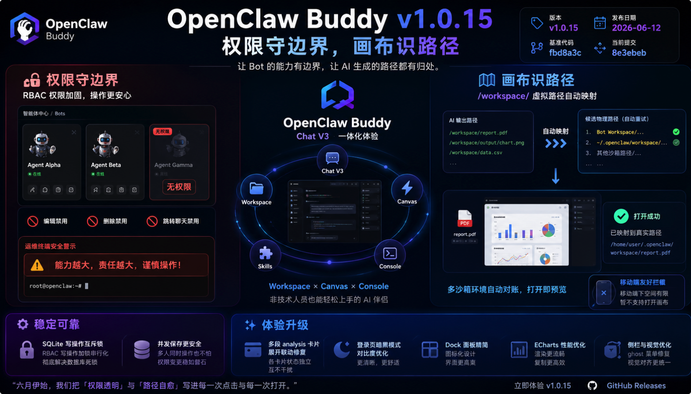

# OpenClaw Buddy v1.0.15：权限守边界，画布识路径

> "上一版我们把交互自由装进了右侧画布；这一版，我们在权限与路径这两处最容易踩坑的关节上加了保险——Bot 该看的能看、该禁的禁住，AI 吐出来的 `/workspace/` 虚拟路径也能自动对账映射到真实磁盘。
>
> 普通用户登录后，智能体中心里无权操作的 Bot 卡片会灰显并打上『无权限』标签，编辑、删除、跳转聊天等按钮一律禁用；运维终端顶部新增可关闭的安全警示栏，提醒『能力越大，责任越大』。
>
> 画布直开文件时，系统自动把 `/workspace/xxx` 这类虚拟路径翻译成当前 Bot 工作区或默认 `~/.openclaw/workspace` 下的物理路径并依次重试，多沙箱隔离环境下也能顺利预览；移动端则友好拦截画布打开，侧栏折叠时的 ghost 悬浮菜单残留也一并修掉。
>
> 后端 RBAC 写操作引入互斥锁，彻底终结前端并发保存触发的 SQLite 死锁；登录页暗黑模式对比度、Dock 面板精简、ECharts 图表性能、多段 analysis 卡片展开联动等细节，也都逐一磨平。
>
> 六月伊始，我们把『权限透明』与『路径自愈』写进每一次点击与每一次打开。"

> **版本 (Version)**: v1.0.15
> **发布日期 (Date)**: 2026-06-12
> **基准代码 (Base)**: `fbd8a3c`
> **当前提交 (Commit)**: `8e3ebeb`
> **核心主题**: RBAC 权限 UI 加固（无权限 Bot 禁用与水印、运维终端安全警示）、画布 `/workspace/` 虚拟路径自动映射、SQLite RBAC 写操作互斥锁、Dock/侧栏/登录页/ECharts/analysis 卡片等体验修复、README 零门槛与 Codex 式体验定位重构。

---

## 🚀 新增特性 (New Features)

### 1. RBAC 权限边界可视化：无权限 Bot 禁用与水印 🔐

* **智能体中心权限感知**：`BotsManager` 接入 `allowedBotIDs`，对 RBAC 普通用户无权访问的 Bot 卡片实施全面 UI 降级——卡片灰显、渐变背景收束、在线状态灯隐藏，并醒目打上红色「无权限」标签。

- **操作按钮级禁用**：编辑 Soul/Identity/Memory/Heartbeat/Agents、跳转聊天、工作区浏览、卡片/列表视图的编辑与删除等按钮，在无权限时一律 `disabled`，从交互层杜绝越权操作。
- **列表视图同步**：表格模式下同样展示「无权限」标签并禁用操作列按钮，卡片与列表双视图体验一致。
- **运维终端安全警示栏**：`ShellView` 顶部新增可关闭的 ALERT 警示条——「能力越大，责任越大，谨慎操作！」，提醒操作者终端具备真实系统权限，降低误操作风险。

* **💡 大白话：** 普通用户登录后，只能动自己有权管的 Bot；没权限的虾兵一眼就能认出来，按钮也点不动。开运维终端时还会先看到一条红色提醒，别手滑删错东西。

### 2. 画布虚拟路径自动对账与映射 🗺️

* **多候选路径重试**：在 Chat V3 消息流中点击文件「打开」按钮时，若路径形如 `/workspace/xxx`，系统自动生成候选物理路径列表——优先拼接当前 Bot 的 `currentWorkspacePath`，兜底 `~/.openclaw/workspace`，依次请求后端读取并自动重试。

- **成功反馈含映射状态**：文件读取成功后弹出提示，告知用户实际使用的映射路径，便于在多沙箱/隔离环境下排查路径问题。
- **移动端友好拦截**：移动端点击「打开」时提示「移动端下空间有限，暂不支持打开画布」，避免小屏强行拉起右侧画布导致布局错乱。

* **💡 大白话：** AI 经常输出 `/workspace/报告.pdf` 这类虚拟路径，以前可能打不开；现在 Buddy 会自动帮你翻译成真实磁盘路径并挨个试，试通了就直接在画布里预览。

---

## 🛠️ 稳定性、修复与体验打磨 (Fixes & Chores)

### 1. SQLite RBAC 死锁根治 🔒

* **互斥锁同步写操作**：在 `internal/utils/rbac.go` 引入 `rbacMu sync.Mutex`，对所有 RBAC 写操作加锁串行化，彻底终结前端并发保存用户/角色/权限时触发的 `database is locked` SQLite 死锁冲突。

* **💡 大白话：** 用户管理页面如果多人同时改权限、或者前端连续点保存，以前可能撞库锁死；现在后端排队写，稳了。

### 2. 前端 UI/UX 细节修复 ✨

* **多段 analysis 卡片展开联动修复**：同一条消息内若有多张 analysis 思考卡片，以前共用展开 key 导致点一张全部展开；现按渲染顺序分配独立 key，各卡片展开状态互不干扰。

- **登录页暗黑模式对比度**：修复 Token 登录 Tab 与输入框在暗黑主题下文字/边框看不清的问题，登录首屏可读性显著提升。
- **右侧 Dock 面板精简**：文件浏览器、实时画布、运维终端三个子面板移除与外部拖拽条重复的文字标题，仅保留文件夹、闪电、命令行等图标，界面更紧凑清爽。
- **侧栏 ghost 菜单残留修复**：侧栏折叠时 ghost 悬浮菜单不再残留于页面，避免误触与视觉干扰。
- **Dock 视觉对齐**：右侧 Dock 分界线与细线样式统一对齐，整体视觉一致性提升。
- **ECharts 图表性能优化**：聊天气泡内 ECharts 图表显示效果与渲染性能调优；复制函数以 `useCallback` 重构，减少不必要的组件重渲染。

### 3. 文档与产品定位 📄

* **README 产品定位重构**：将「带外管理 (OOB)」表述调整为「零门槛 Web 管理台与对话伴侣」，突出非技术人员可用、Workspace/Skills/Console 同屏打通及 Chat V3 **Codex 式一体化体验**；中英文 README 同步更新。

---

## 📄 变更清单 (Commit Log)

> 下列为 **`fbd8a3c..8e3ebeb`** 区间内 **非 merge** 提交（时间新 → 旧）。

| 简写    | 描述                                                                                                                                 |
| :------ | :----------------------------------------------------------------------------------------------------------------------------------- |
| f761727 | docs: 重构 README 产品定位，强调零门槛与 Codex 式体验                                                                                |
| aea05e3 | fix(v3): 修复同条消息多段 analysis 卡片展开状态联动                                                                                  |
| 5cb3b0c | style(login): 修复暗黑模式下登录页输入框及 Token 登录 Tab 看不清的对比度缺陷                                                         |
| 780c634 | style(web): 清理右侧 Dock 面板子组件头部的冗余文字标题，保持图标展示                                                                 |
| a5a1e2e | style(web): 限制移动端画布打开、修复侧栏折叠时 ghost 悬浮菜单残留 Bug，并对齐右侧 Dock 视觉样式与分界线细线                          |
| dad6969 | docs(test): 在测试清单中新增画布打开文件虚拟路径自动对账与映射的测试项                                                               |
| 7dcf841 | feat(web): 支持在画布打开文件时自动做工作区路径映射，解决 `/workspace/` 虚拟路径访问问题                                             |
| 4af9612 | style(web): 优化 ECharts 图表在聊天气泡中的显示效果与性能，并使用 useCallback 重构复制函数以减少不必要的渲染                         |
| c551f29 | feat: 限制无权限 Bot 按钮，新增无权限水印与运维终端安全警示栏，并更新测试清单                                                        |
| 984ecba | fix: 引入互斥锁同步 RBAC 写操作，彻底解决前端并发保存引发的 SQLite 死锁冲突                                                          |

---

## 📦 发布产物 (Release Artifacts)

* 🐧 **Linux (amd64)**: `openclaw-buddy-linux-1.0.15.tar.gz`
* 🍎 **macOS (Universal)**: `openclaw-buddy-mac-1.0.15.tar.gz`

🔗 **下载地址**: [GitHub Releases v1.0.15](https://github.com/RandyChen1985/openclaw-buddy/releases/tag/1.0.15)

---

## ❤️ 特别致谢

感谢每一位在 RBAC 权限边界与画布路径映射场景里帮我们踩坑、提 Issue 的同伴——你们在多 Bot 隔离环境里的每一次「打不开」与「点不动」，最后都变成了这一版更透明、更可靠的体验。

> "权限若清晰，操作才安心。"

---
