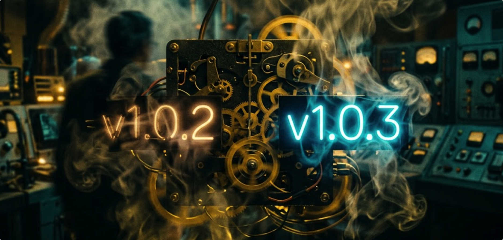

# 🦞 OpenClaw Buddy v1.0.3: 隔离的边界，对齐的视界

> “如果我可以给每一项任务都加一个期限，我希望是零秒。
> 
> 以前，我习惯用厚厚的遮罩藏起所有的不确定，
> 以为只要没人看见，时间在这个页面里就是静止的。
> 直到 4 月 1 日的那一分钟，我决定拆掉所有的屏障，
> 把那些繁琐的逻辑，赶进那个叫‘任务调度中心’的深夜里。
> 
> 我们在 LocalStorage 的边境线上，立起了一座座隔离的碑，
> 让每一个 WebRoot 都能在属于自己的经纬度里，安静地呼吸。
> 从此以后，所有的重启和删除，都只是后台背景里一个转瞬即逝的影子。
> 
> 我不知道这个世界上还有多少东西是不会过期的。
> 但我知道，当滚动条重新在侧边浮现的那一刻，
> 有些‘等待’，终于成了久别重逢的惊喜。”

> **发布日期**: 2026-04-01
> **版本状态**: Production-Ready (LTS)
> **核心主题**: 存储命名空间隔离、全链路 WebRoot 适配、自动化常规测试集成。

---

## 🚀 新增特性 (New Features)

### 1. 存储命名空间隔离 (Storage Namespace Isolation)
*   **机制**: 引入了 `StorageNamespace` 逻辑，基于 `WEB_ROOT` 动态生成本地存储前缀。
*   **价值**: 彻底解决了在同一域名（如 `example.com/a/` 与 `example.com/b/`）下同时开启多个 Buddy 导致的 **Session 互踢与 Token 覆盖**问题。
*   **💡 大白话：** 以前如果你在 `域名/A` 登录了，再去 `域名/B` 登录，`A` 就会被踢下线。现在好了，它们就像住在同一个小区但不同房间的邻居，互不串门，各自安好。

### 2. 全链路 WebRoot 适配与环境对账
*   **路径重构**: 前端路由与 API 基准地址现已完美对齐自定义 `WEB_ROOT`，支持 Nginx 反向代理下的任意二级路径无损部署。
*   **版本比对**: 实现了 Dashboard 与后端二进制文件的版本号自动校验。支持剔除 `v` 前缀的语义化版本比对，当环境不一致时会实时触发桌面级警示。
*   **💡 大白话：** 以前 Buddy 只能住在别墅（根目录 `/`），现在你想给它搬到公寓的一个房间（子路径 `/claw/`）也没问题，地址解析全都自动对齐，再也不会迷路（404）。

### 3. 任务引擎 2.0: 异步调度与自愈同步 🚀
*   **全屏遮罩溢出**: 全面移除了阻断交互的全屏加载 Mask。
*   **异步串行队列**: 引入了 `Shadow Task Engine`，高危或耗时操作（网关重启、模型同步、全量删除）现在会进入后台静默排队。
*   **自愈对账 (Reconciliation Loop)**: 建立了任务驱动的数据对账机制。异步任务完成后会自动触发状态校准，确保前端数据始终为“最终一致性”。
*   **💡 大白话：** 以前点个“重启网关”，页面会弹个大圆圈让你盯着看好几秒。现在你点完可以立马去刷别的页面，Buddy 会在后台排队默默把事儿办完，办完后还会自动帮你把数据对齐，主打一个“懂事”。

### 4. 自动化测试体系 (Testing Engine Integration)
*   **全量回归测试**: 自 `4f858f1` 以来，我们引入了完整的 API 自动化测试体系（Mock 服务、测试文档与自动化脚本）。
*   **测试清单子系统**: 建立了 `tests/CHECKLIST.md` 动态对账体系，确保每一个功能点都在受控状态下发布。

---

## 🎨 UI & 交互精修 (UX Enhancements)

*   **Markdown 编辑器滚动修复**: 特别针对 macOS 用户，深度修复了机器人“人格”与“身份”编辑器中左侧源码框的滚动条缺失问题。通过高度透穿技术，即使编辑数万字的复杂画像也依然丝滑。
*   **Dashboard 响应式布局**: 优化了 Dashboard 在 13 寸笔记本及平板上的显示逻辑，新增了手动刷新反馈，让每一个任务的状态同步都清晰可见。
*   **版本监控透明化**: 在侧边栏新增了 Buddy 版本显示，并针对版本落后情况实现了智能提示比对。

---

## 🛠️ 性能与 Bug 修复 (Bug Fixes)

*   **流式对话稳定性**: 深度优化了流式 API 响应的重连逻辑，修复了在弱网环境下可能出现的 Segment 截断。
*   **并发任务回收**: 增强了“影子任务”执行后的自动回收机制，解决了内存长期运行下的轻微增长风险。
*   **身份标识系统**: 统一了全站的 Identity 标识配色方案，根据 Bot 索引自动适配绚丽的色彩层级。

---

## 📦 发布产物 (Release Artifacts)

*   🐧 **Linux (amd64)**: `openclaw-buddy-linux-1.0.3.tar.gz`
*   🍎 **macOS (Universal)**: `openclaw-buddy-mac-1.0.3.tar.gz`

🔗 **全平台官方下载地址**: [GitHub Releases v1.0.3](https://github.com/RandyChen1985/openclaw-buddy/releases/tag/1.0.3)

---

## ❤️ 特别致谢
感谢所有在 v1.0.3 构建过程中贡献代码与灵感的小伙伴。特别感谢对 WebRoot 适配提出深度建议的同学，是你们对生产级稳定性的追求，让 Buddy 变得更加成熟。

> “在代码的世界里，每一次隔离都是为了更好的重逢。”

---

**RandyChen1985 / openclaw-buddy**
