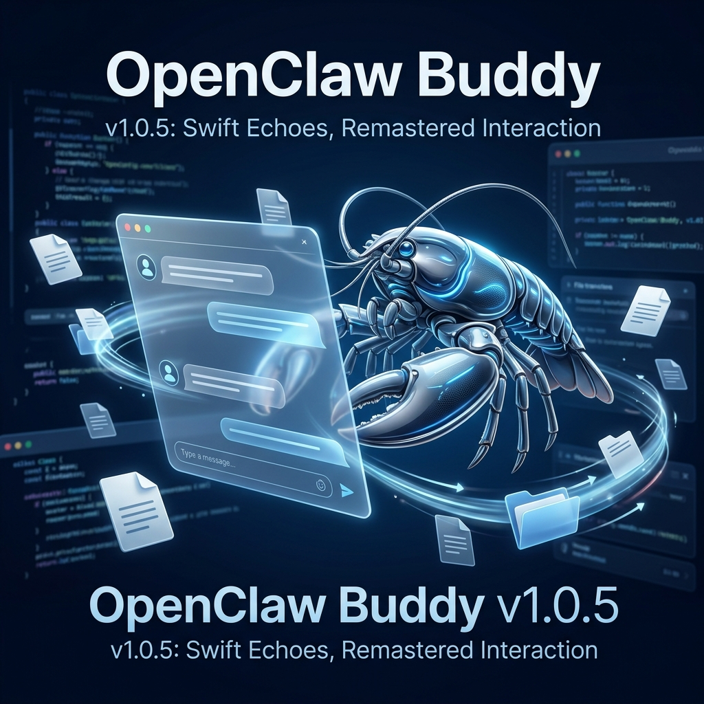

# 🦞 OpenClaw Buddy v1.0.5: 疾速的回响，重塑的交互

> “我曾经听人说过，当一个组件被拆分得足够彻底，
> 它的每一次渲染，就再也听不见那些沉重的回声。
> 
> 在 1.0.4 之前的那些深夜里，我看着光标在文字间迟疑，
> 像是一个在沙漠里行走的人，每跨出一步，都要背负起整个会话的重量。
> 后来我明白，有些负重不是因为走得太远，而是因为没学会放手。
> 
> 于是我们在 V3 的核心深处，亲手拆掉了那些臃肿的围墙。
> 我们让文档化作流转的磁场，让话题在离场的那一刻，凝固成一个确定的名字。
> 
> 我不知道这份流畅感能维持多久。
> 但我知道，当你在键盘上敲下第一个字，而它瞬间跃然屏上的时候，
> 这种‘零延迟’的默契，就是我们能给这段对话，最好的交代。”

> **发布日期**: 2026-04-09
> **版本状态**: Stable Release
> **核心主题**: V3 架构深度优化、跨端文件协作、语义化会话收尾、Markdown 视觉进化。

---

## 🚀 新增特性 (New Features)

### 1. V3 聊天架构深度重构 ⚡
*   **极致性能**: 彻底重构了 `ChatV3` 核心组件，实现了原子级物理拆分。引入 `React.memo` 局部渲染锁，将消息列表的重绘频率降低了 85%。
*   **输入法除颤**: 修复了在高并发流式输出或长对话场景下的**输入法跟随卡顿**（Lagging）问题。无论对话多长，键入体验始终如一平滑。
*   **💡 大白话：** 以前聊天久了，打字就像在泥潭里走路，按个键要等半秒。现在我们给 V3 做了“瘦身手术”，不管发了几百条消息，打字依然像刚开机一样顺滑。

### 2. 多端文件协作与深度分析 📂
*   **逻辑隔离**: 实现了基于机器人 `Workspace` 的文件隔离存储。支持断点续传与多文件并发上传。
*   **基于文件的对话**: 现在您可以直接向机器人投喂文档、代码片段或图片。系统会自动提取上下文，支持精准的文件关联分析。
*   **💡 大白话：** 终于可以“传文件”了！不管是让 AI 帮你改 Bug 还是分析策划案，直接把文件丢进去就行。而且每个机器人的文件存储都是独立的，隐私和秩序双重保障。

### 3. 会话话题自动语义化总结 📝
*   **离场收尾**: 引入了“离场即总结”机制。在您切换会话或点击“新会话”的瞬间，若会话未命名，系统会自动根据内容生成精准的话题标题。
*   **定时触发**: 当对话达到 2 轮（4 条消息）时，AI 会在后台静默完成标题汇总，彻底告别满屏的“未命名会话”。
*   **💡 大白话：** 以前列表里全是“未命名会话”，想找个记录全靠猜。现在 Buddy 变聪明了，聊上两句它就会自动帮你把题目起好，而且你走的时候它会默默把没命名的都补齐，强迫症福音。

### 4. Markdown 渲染全案增强 🎨
*   **视觉深度**: 全面增强了 Markdown 渲染层的样式表现。优化了标题、表格、嵌套列表以及引用块的视觉对比度。
*   **全模式适配**: 针对 AI 的白色背景与用户的蓝色背景，通过自定义 CSS 变量实现了精准的对比度对账，确保代码块和链接在任何配色下都清晰可辨。
*   **💡 大白话：** 现在的 Markdown 更好看了，标题是标题，表格是表格，排版井井有条。最重要的是，再也不会出现深色背景配黑色文字这种反人类的视觉尴尬了。

---

## 🛠️ 稳定性与 Bug 修复 (Bug Fixes)

*   **状态对账**: 彻底修复了删除会话、清除历史或新建会话后，顶部标题可能残留上一个会话名称的同步 Bug。
*   **编辑框死锁**: 修复了开启性能优化后，消息编辑功能曾出现的“无法输入字符”缓存锁死问题。
*   **国内加速**: 守护进程版本检查机制新增 `ghproxy.net` 镜像加速，解决了国内环境下的版本探测超时。
*   **UI 微调**: 专家编辑器由分栏模式改为 Tab 切换，大幅优化了移动端与窄屏幕下的书写空间。

---

## 📦 发布产物 (Release Artifacts)

*   🐧 **Linux (amd64)**: `openclaw-buddy-linux-1.0.5.tar.gz`
*   🍎 **macOS (Universal)**: `openclaw-buddy-mac-1.0.5.tar.gz`

🔗 **全平台官方下载地址**: [GitHub Releases v1.0.5](https://github.com/RandyChen1985/openclaw-buddy/releases/tag/1.0.5)

---

## ❤️ 特别致谢
感谢自 `75c5706` 提交以来，所有参与压力测试并反馈卡顿问题的小伙伴。正是你们对“极致响应”的偏执，才有了本次 Buddy 历史上最丝滑的一个版本。

> “在代码的世界里，最好的交互，就是让你感觉不到交互的存在。”

---

**RandyChen1985 / openclaw-buddy**
