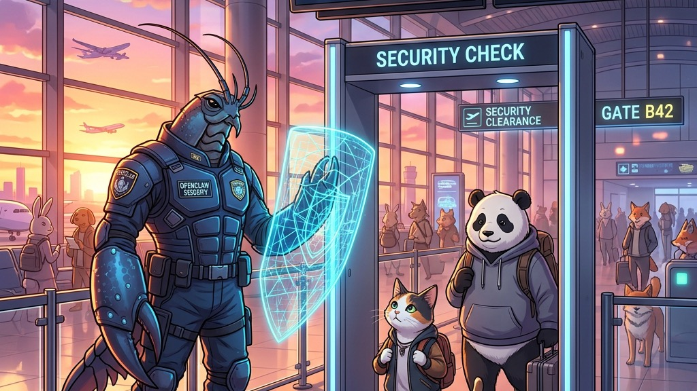

# 🦞 OpenClaw Buddy v1.0.6: 安全的护航，可视的消息

> “我记得那天，屏幕上的光影流转，
> 指令穿梭在看不见的维度里，像是深夜里擦肩而过的列车。
> 有人问我，安全是什么？
> 我说，安全不是铜墙铁壁，而是当你在键盘上敲下回车时，那一抹笃定的审批弧光。
>
> 在 1.0.5 之后的那些日子，我们看着数据化作纯粹的图表，
> 像是在无序的荒野里，种下了一排排整齐的坐标。
> 交互不再是冷冰冰的握手，而是像水一样，自动聚焦在你最需要的地方。
>
> 我不知道这份宁静能维持多久。
> 但我知道，当你在安全中心按下‘一键审批’，
> 看到 ECharts 渲染出那些跃动的数据时，
> 这种‘尽在掌握’的默契，就是我们能给这个复杂世界，最温柔的护航。”

> **发布日期**: 2026-04-12
> **版本状态**: Stable Release
> **核心主题**: 安全中心上线、ECharts 动态图表、ChatV3 交互进化、全平台体验优化。

---

## 🚀 新增特性 (New Features)

### 1. 全新安全中心上线：守卫每一行指令 🛡️

* **策略审批**: 引入了完善的指令审批机制。支持配置 `ask` (询问) 与 `security` (安全等级) 策略。
* **可视化审批**: 在 ChatV3 聊天流中直接嵌入审批卡片，点击即可“一键授权”或“阻断执行”。
* **移动端适配**: 深度优化了移动端下的策略卡片布局，确保在手机窄屏上也能从容管理安全预设。
* **💡 大白话：** 现在 Buddy 有了“安检员”。AI 想执行敏感命令？它会先在聊天里给你发个“申请”，你点一下通过它才敢动。再也不用担心 AI 背后搞小动作了。

### 2. V3 聊天支持 ECharts 图表渲染 📊

* **数据可视化**: 聊天消息解析引擎现已全面支持 ECharts 渲染。AI 生成的数据不再只是枯燥的文本或 Markdown 表格，而是跃然屏上的动态图表。
* **极致交互**: 支持缩放、悬停查看数据细节，完美适配深色/浅色模式。
* **💡 大白话：** AI 帮你分析预算或流量时，终于不再只会吐一堆数字了。现在的它会直接给你画个饼图、折线图甚至是复杂的关系图。数据一眼看穿，老板看了都说好。

### 3. ChatV3 交互体验深度进化 ⚡

* **自动聚焦与回弹**: 发送消息后，输入框会自动重获焦点；收到新消息时，视口将精准强制回弹到底部，不再丢失上下文。
* **折叠式推理块**: 将 AI 的“思考过程”与“工具调用”封装进美观的交互式折叠卡片，保持主会话流清爽不冗长。
* **PDF 横屏导出**: 针对包含大量代码或图表的 AI 响应，新增了 PDF 横屏导出功能，完美复刻网页端的精致排版。
* **💡 大白话：** 我们给聊天室装了“智能导航”。AI 回复时屏幕自动跟着走，打字时不用再手动点输入框。那些太长的“碎碎念”思考过程现在被叠起来了，想看就点，不看就藏，清清爽爽。

### 4. 稳定性与视觉精进 🎨

* **状态原子化**: 彻底修复了跨会话状态泄露与删除会话超时的问题。引入了会话状态原子化持久化机制，切换再快也“不忘初心”。
* **Indigo 配色升级**: 全站视觉升级为更具科技感的 Indigo (靛蓝) 色系，并针对移动端进一步收紧了 UI 边距，提升信息密度。
* **💡 大白话：** 修复了以前偶尔会出现的“串味”Bug（删了会话还有标题残留）。现在的界面更蓝更清晰了，而且手机上看内容更多，操作更顺手。

---

## 🛠️ 稳定性与 Bug 修复 (Bug Fixes)

* **逻辑加固**: 修复了由于闭包陷阱导致的自动滚动异常，滚动判定容差精准捕捉手动阅读意图。
* **渲染除颤**: 修复了 ChatV3 在极长对话下的渲染闪烁，优化了侧边栏会话信息的展示优先级。
* **构建补丁**: 优化了 `build_linux.sh` 和 `build_mac.sh`，支持在 macOS 下自动搜索并路径补齐系统工具。
* **思考计时器**: 在 AI 思考阶段新增实时计时器，让“漫长”的等待可见、可预期。

---

## 📦 发布产物 (Release Artifacts)

* 🐧 **Linux (amd64)**: `openclaw-buddy-linux-1.0.6.tar.gz`
* 🍎 **macOS (Universal)**: `openclaw-buddy-mac-1.0.6.tar.gz`

🔗 **全平台官方下载地址**: [GitHub Releases v1.0.6](https://github.com/RandyChen1985/openclaw-buddy/releases/tag/1.0.6)

---

## ❤️ 特别致谢

感谢自 `002c29f` 提交以来，所有支持的伙伴。你们的每一次“拒绝审批”，都让 Buddy 的防线更加稳固。

> “安全的最高境界，是让你在自由探索的同时，感到背后有一双守护的眼睛。”

---

