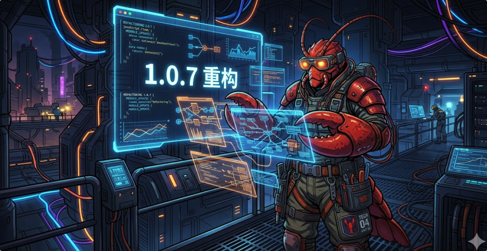

# 🦞 OpenClaw Buddy v1.0.7: 重构之美，自愈之韧

> “秩序，往往诞生于繁杂的深处。
> 
> 在 1.0.6 建立起安全的防线后，我们开始审视那些藏在代码褶皱里的‘暗礁’。
> 如果说之前的版本是赋予 Buddy 灵魂，那么 1.0.7 则是在重塑它的骨骼。
>
> 我们重构了 ChatV3，让每一个会话的来源都有迹可循，让 AI 的思考不再是不可控的黑盒；
> 我们引入了自愈管理，赋予系统修复自身脆弱的能力，哪怕面对混乱的配置也能‘一键归位’。
> 
> 最重要的是，我们将指令的执行推向了并行的轨道。
> 不再等待，也不再依赖。
> 这不是一次简单的跨越，而是一场关于‘效率’与‘韧性’的深层进化。”

> **发布日期**: 2026-04-16
> **版本状态**: Stable Release
> **核心主题**: ChatV3 深度重构、自愈管理子系统、指令并行执行、极致稳定性加固。

---

## 🚀 新增特性 (New Features)

### 1. ChatV3 视觉与逻辑重构：灵动、可知、可控 🎭

在 1.0.7 中，ChatV3 迎来了一次全方位的交互革命，重点解决复杂会话下的认知负担。

* **渠道可视化**: 会话列表现在能够一眼识别来源。无论是来自 **飞书 (Feishu)**、**微信 (WeChat)**、**Telegram**，还是自动化的 **定时任务 (Cron)**，专属图标让管理效率翻倍。
* **状态指示灯**: 新增生成状态实时反馈。切换到其他会话时，侧边栏的“脉冲”动画会明确告知哪些会话正有 AI 内容在生成中。
* **多维主题系统**: 引入全新的“雅致灰 (Elegant Gray)”等主题模式，搭配彩色设置按钮，满足不同审美与办公场景的需求。
* **思考过程深度定制**: 
    - 支持手动开启/关闭“思考”流。
    - **思考等级控制**: 提供分级调节能力，让 AI 的逻辑推理深度完全在你的掌控之中。
* **💡 大白话：** 现在你的聊天列表更清晰了，哪些是机器人发的，哪些是定时任务干的一目了然。AI 正在别处想问题时，侧边栏会有个小灯在闪。而且，如果你嫌 AI 太啰嗦，现在可以直接关掉它的“碎碎念”，或者让它想深一点。

### 2. 自愈管理系统：系统配置的“随身医生” 🏥

针对复杂的 OpenClaw 环境配置，我们上线了自愈管理模块，让运维变得触手可及。

* **在线配置编辑器**: 无需登录服务器修改文件。现在直接在 Web 端即可安全地编辑 `openclaw.json`，并支持语法高亮与校验。
* **Doctor 一键修复**: 集成 `openclaw doctor` 能力，支持一键扫描环境，自动识别并指引修复配置漏洞或依赖丢失问题。
* **💡 大白话：** 以后配置搞乱了不用怕，也不用去翻服务器改文件。直接在网页里改配置，或者点一下“医生”按钮，系统会自动检查哪儿坏了并帮你修好。

### 3. 指令并行化架构：快，且独立 ⚡

为了追求极致的响应速度，我们对底层的指令调度逻辑进行了重构。

* **并行执行引擎**: 所有的 OpenClaw 指令调用现已改为并行执行。多任务分发不再受单线程阻塞困扰，性能上限显著提升。
* **网关状态解耦**: 指令级管理不再强依赖于网关是否开启。即使在网关离线状态下，核心管理指令依然能精准触达。
* **💡 大白话：** 以前 Buddy 像是一个窗口只能排队办事，现在变成了多个窗口同时开工。而且不管“大门”（网关）开没开，你都能在后台直接点名指挥 AI 兵团。

---

## 🛠️ 稳定性与 Bug 修复 (Bug Fixes)

* **解析鲁棒性**: 彻底重塑了 Agent 与 Model 的解析逻辑。通过 stdout/stderr 物理隔离技术与增强型 `ExtractJSON` 算法，屏蔽了 CLI 杂质干扰，杜绝“解析失败”报错。
* **消息时序加固**: 修复了 V3 模式下切换会话时，AI 消息可能在渲染瞬间出现在用户消息上方的逻辑漏洞，确保对话流的时间线性。
* **标题生成防御**: 优化了自动标题触发机制，解决了由于连接重试或并发产生标题重复重叠的 Bug。
* **配置校验沙箱**: 增加了 `openclaw config validate` 的详细反馈，防止无效的环境变量导致配置丢失。
* **视觉细节补丁**: 修复了 JSON 编辑器光标由于内边距导致的不对齐，以及移动端下设置菜单的排版溢出问题。

---

## 📦 发布产物 (Release Artifacts)

* 🐧 **Linux (amd64)**: `openclaw-buddy-linux-1.0.7.tar.gz`
* 🍎 **macOS (Universal)**: `openclaw-buddy-mac-1.0.7.tar.gz`

🔗 **下载地址**: [GitHub Releases v1.0.7](https://github.com/RandyChen1985/openclaw-buddy/releases/tag/1.0.7)

---

## ❤️ 特别致谢

感谢自 `ceee9b8` 提交以来提供的反馈。每一次系统的“自愈”，都是为了下一次更稳定的出发。

> “在并行的数字海洋里，唯有重构之后的秩序，才能让航行更远。”

---

