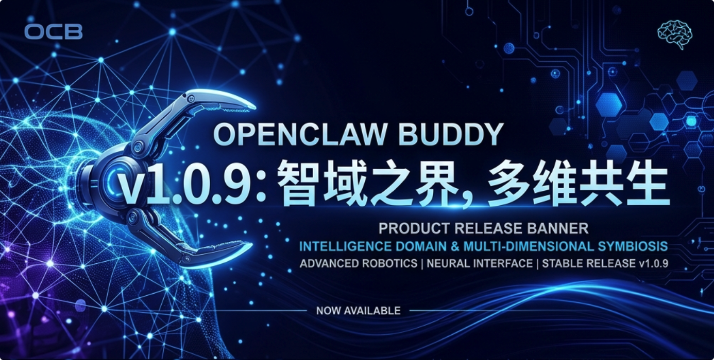
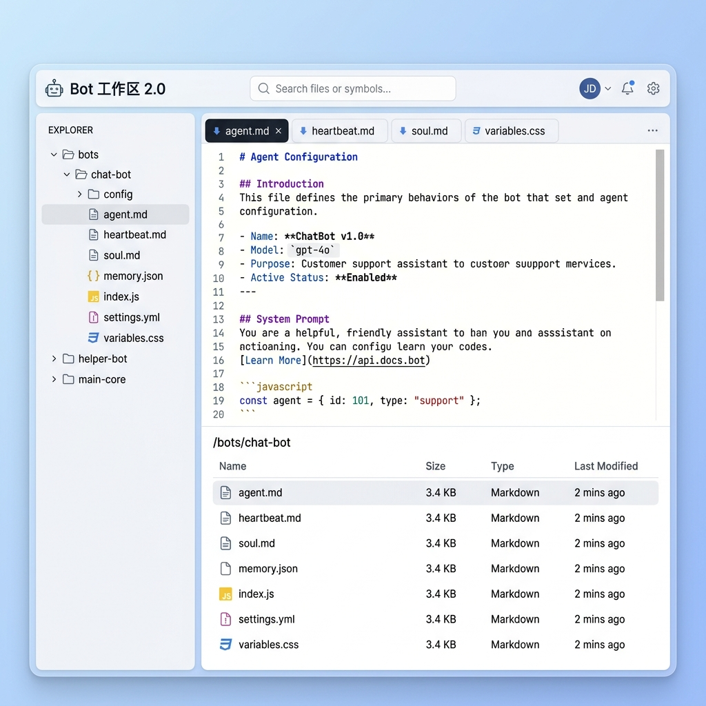
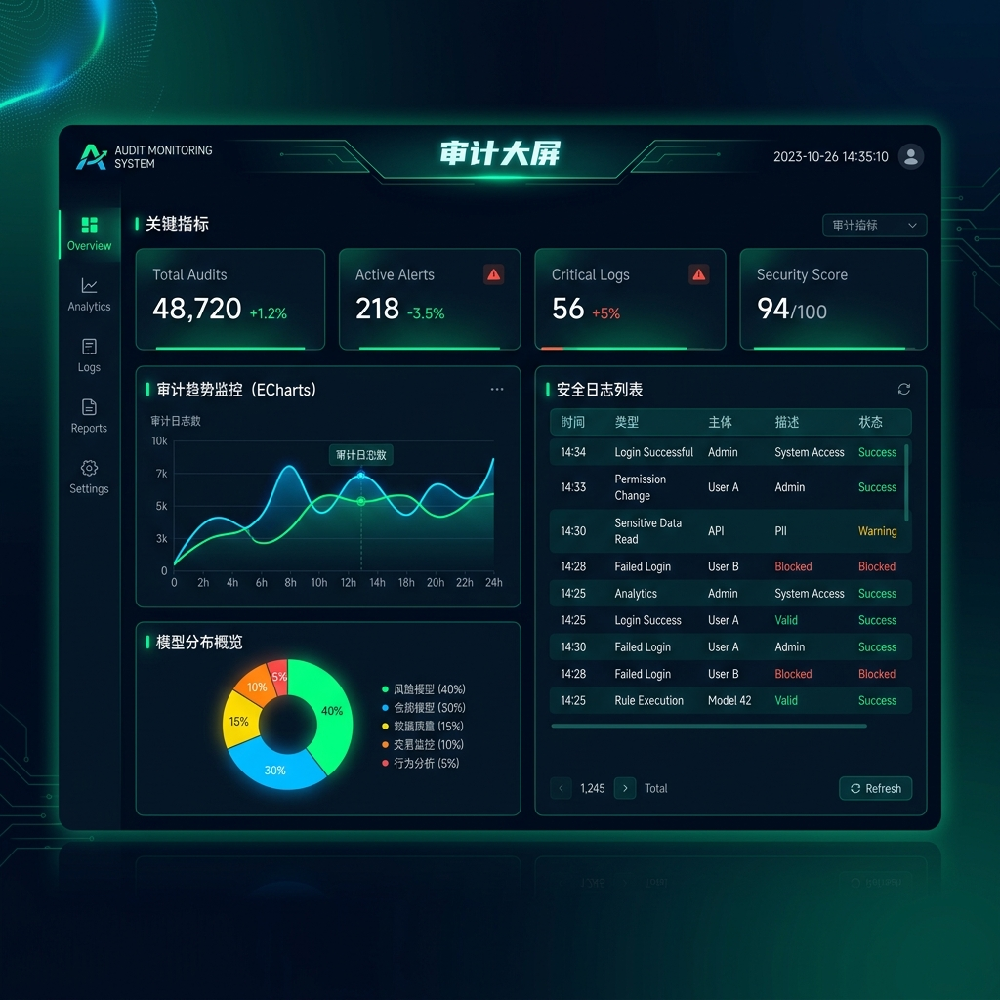
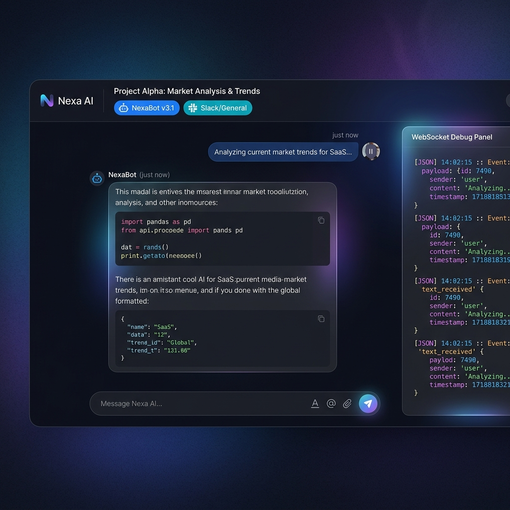

# 🎷 OpenClaw Buddy v1.0.9: 智域之界，多维共生

> “在智能的疆域里，连接的深度决定了进化的维度。
>
> 如果说 1.0.8 是在重塑 Buddy 的‘重构’与‘节律’，那么 1.0.9 则是在拓宽 Buddy 的‘视界’、‘触达’与‘性能极限’。
>
> 本次版本，我们深入 Bot 的灵魂深处，将 `agent.md` , `heartbeat.md` , skills 管理纳入手心，开启了 Bot 工作区 2.0；
> 我们打破了平台的藩篱，飞书、Telegram、QQBot 在此共生，实现了全渠道的丝滑触达；
> 我们开启了审计的大屏，让每一份算力与流量的流动都清晰透明；
> 我们更是在 Chat V3 的底层进行了‘手术级’的性能调优，让响应速度跨越了次元。
>
> 触达无界，智域共生。”

> **发布日期**: 2026-04-25
> **版本状态**: Stable Release
> **核心主题**: Bot 工作区 2.0、全渠道绑定（飞书/TG/QQ）、审计大屏、Chat V3 沉浸式与性能大爆发。

---

## 🚀 新增特性 (New Features)

### 1. Bot 工作区 2.0：深度掌控每一个字节 📂

Bot 的“灵魂文件”不再神秘。现在，你可以像管理本地磁盘一样管理 Bot 的工作区。

* **核心配置可视化**: 直接编辑 `agent.md` (行为定义) 与 `heartbeat.md` (心跳逻辑)，实时调整 Bot 的底层性格与运行节律。
* **全功能文件管理**: 支持文件的 **上传、下载、在线编辑与删除**。配合 Markdown 实时预览，无论是知识库文档还是临时生成的日志，尽在掌握。
* **💡 大白话：** 现在你可以直接钻进机器人的“脑子里”改它的说明书了。想要给它传文件，或者把它写的东西下到本地，点点鼠标就能搞定。

### 2. 全渠道联动：打破次元壁的触达 🌍

OpenClaw Buddy 的连接能力再次进化，支持更多主流社交通讯平台。

* **多平台对齐**: 现已完美集成 **飞书 (Feishu/Lark)**、**Telegram** 与 **QQBot**。
* **一键绑定逻辑**: 优化了渠道绑定的 UI 交互，支持多账号并行管理，大幅降低了各平台 Token 与 Webhook 的配置门槛。
* **💡 大白话：** 现在你可以把 Buddy 连到飞书、Telegram 甚至 QQ 群里了。不管你在哪，Buddy 都能随时待命，多平台消息同步收发。

### 3. 审计大屏：智能视界的洞察者 📊

新增全局审计监控大屏，将抽象的数据转化为直观的视觉洞察。

* **实时数据洞察**: 基于 ECharts 构建的动态图表，全天候监控 Token 消耗趋势、Agent 分布、模型覆盖度及工具调用频率。
* **安全合规追踪**: 独立的审计日志系统，实时追踪高风险指令与异常调用，支持关键词搜索与风险等级过滤。
* **💡 大白话：** 出个“监控大屏幕”，一眼就能看到机器人今天花了多少钱、哪个机器人最忙、系统累不累。

### 4. Chat V3 沉浸式体验：全屏、调试、美学 🎮

我们对 Chat V3 进行了全方位的交互重塑与性能调优，打造极致的 AI 聊天环境。

* **沉浸式全屏模式**: 支持 `Cmd/Ctrl + F` 快速进入全屏，配合精心设计的 **胶囊顶栏**（来源渠道与机器人标签），让灵感不再受外界干扰。
* **性能“手术级”调优**: 并发化 Ticket 与网关 Token 的获取流程，**移除人为 300ms 延迟**，首屏加载速度提升 50% 以上。
* **智能停顿感知**: 优化了 Stall Timer 逻辑，仅在文字流（Delta）真正停顿且非元数据更新时触发安抚文案，让“AI 还在思考”的提示更精准。
* **WebSocket 实时调试**: 内置 WS 日志面板，实时监控底层协议流，针对深色模式进行了可见度专项优化。
* **💡 大白话：** 聊天界面能全屏了，而且响应速度变得飞快，几乎秒开。顶部的标签变漂亮了，还加了个“调试模式”，高手查问题时更方便。

---

## 🛠️ 稳定性与一系列优化 (Optimizations & Fixes)

在 1.0.9 的迭代中，我们不仅关注新功能的堆叠，更对系统的“底层素质”进行了深度打磨。

### 1. 性能与并发：从“加载”到“秒开” ⚡

* **首屏加载飞跃**: 全面重构了 Chat V3 的初始化流程，支持并发拉取 Ticket 和网关 Token，**彻底移除了人为设置的 300ms 延迟缓冲**。现在的会话初始化几乎达到了毫秒级响应。
* **并行事务追踪**: 引入了 `activeRuns` 机制，实现了对复杂 Agent 任务的多并行事务追踪，解决了在多步骤推理中思考状态可能被提前释放的顽固 Bug。
* **高效轮询机制**: 优化了全局状态轮询，在保证消息实时性的同时，降低了前端对后端的无效请求频率。

### 2. 协议与交互：告别“闪烁”与“误判” 🛡️

* **权威状态同步**: 基于 `sessions.changed` 事件实现了前端与网关状态的 1:1 镜像同步，彻底解决了输入框“打字锁”在切换会话时的状态残留与闪烁问题。
* **智能停顿算法**: 精简了 Stall Timer (停顿计时器) 逻辑。现在，计时器仅在收到真正的 Delta 文字流时刷新，排除了 Token/费用等元数据更新对计时的干扰，确保“安抚文案”触发得恰到好处。
* **延时释锁优化**: 优化了 `agent lifecycle.end` 与 `chat.final` 的竞争逻辑。即使在极端的网络波动下，系统也能确保在正确的时间点解锁输入区。

### 3. UI/UX 精细化：每一个像素的坚持 🎨

* **顶栏胶囊化设计**: 对 Chat V3 顶栏进行了视觉重构。标签采用 **999px 全圆角胶囊设计**，并增加了灵动的悬浮（Hover）变色反馈。
* **编辑体验增强**: 为所有核心编辑器引入了 **Token 实时估算浮标**，在保存前即可预知用量；修复了灵魂编辑器 (Soul Editor) 在预览模式下的 Markdown 渲染与滚动冲突。
* **响应式适配**: 修复了侧边栏在折叠状态下菜单项名称消失的 Bug，并对机器人卡片与记忆编辑器在不同分辨率下的布局进行了抗压测试。

### 4. 后端与系统健壮性：稳如磐石的根基 🏗️

* **路径自动展开**: 修复了文件浏览器在处理带波浪号 (`~`) 路径时的 500 错误，增加了对用户主目录路径的自动识别与安全展开。
* **执行超时优化**: 全面调优了后端指令执行的超时阈值（Timeout），完美适配重型插件的加载需求，杜绝了在高负载下的 Context 超时报错。
* **配置持久化修复**: 确保所有渠道绑定配置都能精准写入对应的隔离环境目录，并增强了对物理文件删除的安全校验。

---

## 📦 发布产物 (Release Artifacts)

* 🐧 **Linux (amd64)**: `openclaw-buddy-linux-1.0.9.tar.gz`
* 🍎 **macOS (Universal)**: `openclaw-buddy-mac-1.0.9.tar.gz`

🔗 **下载地址**: [GitHub Releases v1.0.9](https://github.com/RandyChen1985/openclaw-buddy/releases/tag/1.0.9)

---

## ❤️ 特别致谢

感谢每一位在开发过程中提供反馈的贡献者。每一次“性能的压榨”与“界面的雕琢”，都是为了让 Buddy 成为更懂你的智能伙伴。

> “在多维的共生中，我们不仅仅是工具的制造者，更是智能边界的开拓者。”

---
