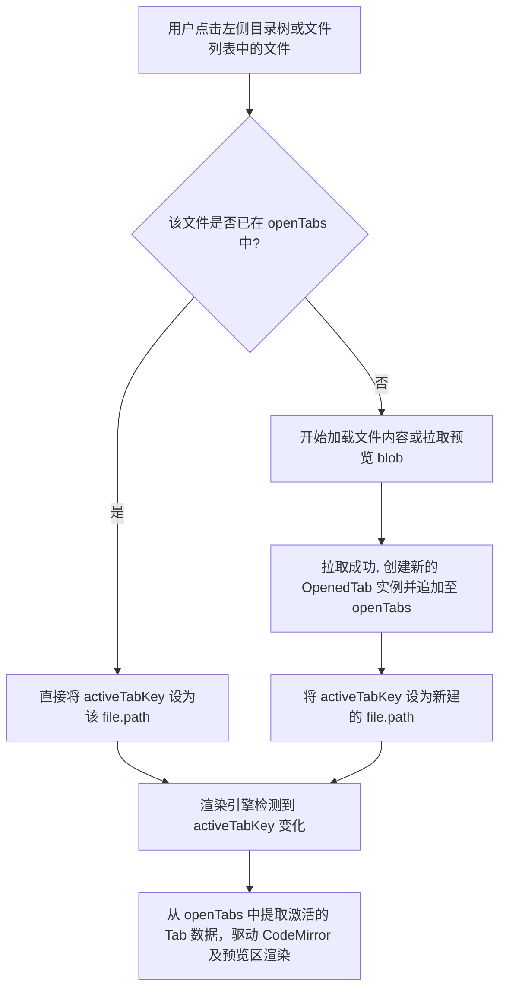

# 文件浏览器多标签页 (Multi-Tab) 升级设计规格书

本设计文档旨在将 `openclaw-buddy` 的文件浏览器 (`FileExplorer.tsx`) 从目前的“单文件编辑/查看”模式升级为**现代化多标签页 (Multi-Tab) 模式**，支持在右侧同时打开、查看、编辑多个文件，并在文件之间进行快速流畅的切换。

---

## 1. 业务目标与用户价值

- **并行查看/编辑**：允许用户同时打开多个配置、日志或 markdown 文件，并在它们之间实现一键切换，极大提升了调试与巡检自愈策略的工作效率。
- **防止数据丢失**：引入 IDE 级未保存修改检测机制，在关闭标签页时提供提示框，防止误关闭导致正在编辑的规则、数据丢失。
- **现代化视觉交互 (Premium Theme)**：采用极客专属的原生 CSS 自定义 Tab 页签栏，配合微缩动画、未保存渐变圆点与 hover 关闭态的无缝转换，让 UI 界面富有科技感与灵动感。

---

## 2. 状态模型设计与数据流

目前在 `FileExplorerContent` 内部，单文件状态由 `selectedFile`、`fileContent`、`activeTab` 等构成。

### 2.1 引入 `OpenedTab` 标签页数据模型

```typescript
interface OpenedTab {
  file: FileEntry;          // 文件元数据
  content: string;          // 实时编辑中的文本内容
  originalContent: string;  // 原始从服务器拉取的内容 (用于 isDirty 对比)
  isDirty: boolean;         // 是否被修改且未保存
  activeTab: 'edit' | 'preview'; // 当前 Tab 的内部视图模式 (编辑或预览)
  
  // 缓存各文件类型的特有预览资源 (Blob URL / 数据集)，防止切换标签页时重复加载
  imagePreviewUrl?: string | null;
  pdfPreviewUrl?: string | null;
  excelData?: { columns: any[], dataSource: any[] } | null;
  wordHtml?: string | null;
}
```

### 2.2 在组件内引入核心状态

```typescript
const [openTabs, setOpenTabs] = useState<OpenedTab[]>([]);
const [activeTabKey, setActiveTabKey] = useState<string | null>(null); // 指向激活 Tab 的 file.path
```

---

## 3. 核心交互流程与实现逻辑



### 3.1 打开文件 (`loadFileContent`)

当用户双击或点击左侧的某个文件时：
1. 检查 `openTabs` 是否已经包含该 `file.path`。
2. 如果存在，直接执行 `setActiveTabKey(file.path)`。
3. 如果不存在，开启 loading 态，请求对应文件接口：
   - 对于文本类文件（如 `.md`、`.json`、`.py` 等），请求 `/v1/openclaw/files/get`。获取内容后创建新的 `OpenedTab`：
     - `content` 与 `originalContent` 均初始化为服务器返回内容。
     - 根据后缀名决定 `activeTab` 默认值（`.md`, `.html` 默认为 `'preview'`，其余默认为 `'edit'`）。
   - 对于媒体及专业文档类文件（`.png`、`.pdf`、`.xlsx` 等），请求 `/v1/openclaw/files/download`，转换为相应的 Blob 并建立预览 URL/数据集。
   - 将新构造的 `OpenedTab` 追加到 `openTabs` 列表中，并将 `activeTabKey` 设为它的 `path`。
   - 触发 `setIsEditing(true)` 保证编辑/查看区展开。

### 3.2 标签页激活与同步机制

使用受控/副作用机制，当 `activeTabKey` 发生改变时，我们需要将局部状态（供 CodeMirror 和各预览器直接受控的 state）同步为当前 Tab 的内容：

```typescript
useEffect(() => {
  const curTab = openTabs.find(t => t.file.path === activeTabKey);
  if (curTab) {
    setSelectedFile(curTab.file);
    setFileContent(curTab.content);
    setActiveTab(curTab.activeTab);
    setImagePreviewUrl(curTab.imagePreviewUrl || null);
    setPdfPreviewUrl(curTab.pdfPreviewUrl || null);
    setExcelData(curTab.excelData || null);
    setWordHtml(curTab.wordHtml || null);
  } else {
    // 若没有激活的 tab，清空受控状态并退出编辑模式
    setSelectedFile(null);
    setFileContent('');
    setIsEditing(false);
  }
}, [activeTabKey, openTabs]);
```

#### 编辑内容同步回 Tab
当用户在 `CodeMirrorTextEditor` 编辑时，我们需要将更改实时同步回 `openTabs` 状态中：
```typescript
const handleContentChange = (val: string) => {
  setFileContent(val);
  setOpenTabs(prev => prev.map(t => {
    if (t.file.path === activeTabKey) {
      return { ...t, content: val, isDirty: val !== t.originalContent };
    }
    return t;
  }));
};
```

---

### 3.3 关闭标签页 (`closeTab`)

当用户点击页签上的 `x` 关闭某标签页 `tabPath` 时：
1. 找出对应的 Tab `tabToClose = openTabs.find(t => t.file.path === tabPath)`。
2. **检查修改状态**：
   - 若 `tabToClose.isDirty === true`，触发确认提示框 (Antd Modal.confirm)：
     > **“文件 [文件名] 已被修改，是否保存您的更改？”**
     - **[保存]**：触发该标签的保存逻辑（调用 API 并更新 `originalContent` 与 `isDirty = false`），保存成功后关闭标签。
     - **[不保存]**：放弃当前修改，直接进入关闭逻辑。
     - **[取消]**：中断关闭流程。
3. **关闭标签逻辑**：
   - 从 `openTabs` 中剔除该 Tab：`const nextTabs = openTabs.filter(t => t.file.path !== tabPath)`。
   - 清理该标签页特有的预览资源 Blob URL，释放内存。
   - **重算焦点激活项**：
     - 若关闭的正是当前激活的 `activeTabKey`：
       - 若 `nextTabs` 不为空，则自动激活被关闭标签**前一个位置**的标签页（若前一个不存在，则选择后一个）。
       - 若 `nextTabs` 为空，则 `setActiveTabKey(null)`。

---

### 3.4 保存当前标签页 (`handleSave`)

点击右下角的浮动“保存”按钮，只保存当前正处于焦点的标签页：
```typescript
const handleSave = async () => {
  if (!selectedFile || !activeTabKey) return;
  setIsSaving(true);
  try {
    await api.post('/v1/openclaw/files/save', {
      path: selectedFile.path,
      content: fileContent
    });
    message.success(t('common.saveSuccess'));
    
    // 更新 openTabs 中的 originalContent 状态，使其不再 Dirty
    setOpenTabs(prev => prev.map(t => {
      if (t.file.path === activeTabKey) {
        return { ...t, originalContent: fileContent, isDirty: false };
      }
      return t;
    }));
  } catch (err: any) {
    message.error(err.response?.data?.error || err.message || t('common.saveFailed'));
  } finally {
    setIsSaving(false);
  }
};
```

---

## 4. UI 布局与 CSS 动效设计

### 4.1 UI 结构（右侧编辑/预览区顶部）

```
+-------------------------------------------------------------------------------+
|  📄 index.css  |  📝 Readme.md •  |  📊 stats.json   | + (New File)           | <- 自定义 Tabs 页签栏
+-------------------------------------------------------------------------------+
| 🔍 Edit / Preview Sub-Tabs                        [⬇️ Download] [🗑️ Delete]   | <- 操作辅助栏
+-------------------------------------------------------------------------------+
|                                                                               |
|                             [ CodeMirror 编辑区 ]                             |
|                                                                               |
+-------------------------------------------------------------------------------+
```

自定义 Tab Bar 页签栏将插入到右侧主体区域的最顶端，代替以前生硬的单文件名展示。

### 4.2 极客定制风格的 Tab 元素设计 (Option A CSS)

使用 Flex 横向流式布局，具备以下视觉亮点：
- **隐藏原生滚动条**，采用隐藏但在横向滚轮滑动时可平滑溢出滚动的特性。
- **非激活标签**：背景呈磨砂微透（暗色系：`#1e293b`），文字为淡灰（`#94a3b8`）。
- **激活标签**：背景与中央编辑器主体高度融合，底部带有一条 **`3px` 高的亮色渐变指示线**（从 `indigo-500` 到 `cyan-500` 的现代光效渐变）。
- **圆点 / 关闭按钮无缝转换 (VS Code 标志性设计)**：
  - 当文件被修改（`isDirty` 为真）时，页签最右侧展示一个 **`8px` 的深紫色/蓝色渐变呼吸光感小圆点**，标明“未保存”。
  - 当鼠标 Hover 到该页签，或者 Hover 到圆点上时，圆点会自动渐变淡出，并转换为半透明的 **`x` 叉号关闭图标**，点击即可直接关闭。
  - 这套细节体验能够极大提升产品的 Premium 感！

---

## 5. 遗留操作与全局事件兼容

1. **物理删除文件**：
   - 当用户在文件列表、树菜单或通过 contextmenu 执行了文件删除操作：
     - 若该文件存在于 `openTabs` 中，物理删除成功后，直接将其从标签页队列中静默清除。如果清除的是激活项，自动重算焦点（无需触发未保存提示，因为文件已从磁盘彻底移除）。
2. **重命名文件**：
   - 当用户对已打开的某个文件进行了重命名（即修改了文件名或路径）：
     - 物理重命名接口返回成功后，在 `openTabs` 队列中寻找到老路径对应的项，将其 `file.path` 更新为新路径，`file.name` 更新为新名字，并同步更新 `activeTabKey` 指向新路径，确保状态连贯。

---

## 6. 测试与验证计划

### 6.1 自动化测试维护
- 更新 `tests/CHECKLIST.md`，追加“文件浏览器多标签页（Multi-Tab）”交互功能的回归测试用例清单。

### 6.2 手工测试验证 (在 `temp-dev-test` 沙箱环境运行)
1. **多标签页开启测试**：依次在左侧双击打开 3-4 个文件，检查右侧 Tab Bar 是否成功排开，文件名及后缀图标是否正确。
2. **切换焦点测试**：点击各个标签，观察编辑器是否准确切换为对应文件的内容，无任何闪烁或数据混乱。
3. **未保存圆点测试**：在其中一个文本文件中敲击字符修改，检查该 Tab 的关闭按钮位置是否立刻转换为“渐变小圆点”；鼠标移上去时，圆点是否无缝渐变切换为 `x` 图标。
4. **关闭与提示机制测试**：
   - 尝试关闭一个修改过的 Tab，检查是否弹出 Modal.confirm 提示；
   - 点击“保存”，检查内容是否写入磁盘且圆点恢复正常；
   - 点击“不保存”，检查是否直接关闭并成功丢弃内存修改；
   - 点击“取消”，检查是否中断关闭。
5. **重命名与删除兼容测试**：对已打开的文件在左侧进行重命名或删除，验证 Tab 的连贯性和销毁动作是否完全符合预期。
